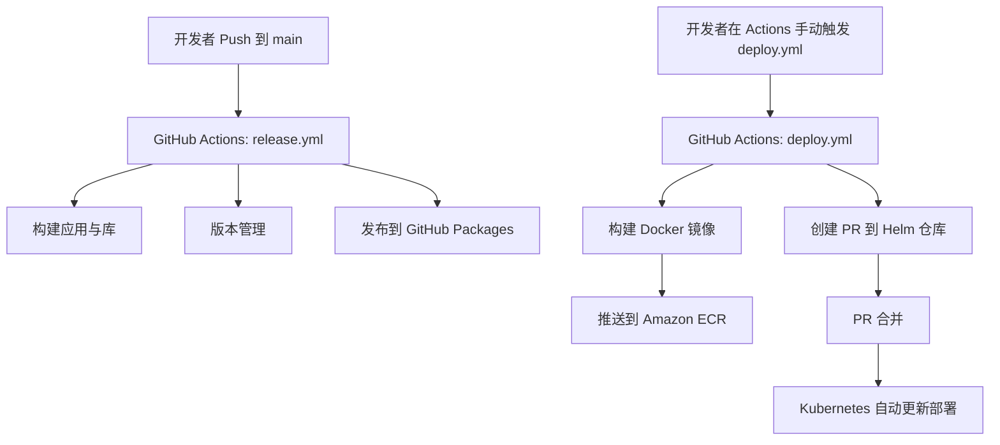

# 项目开发指南

欢迎来到 aitoearn-monorepo 项目！本指南旨在帮助新加入的开发者快速了解项目架构、开发流程和代码规范，从而能够高效地参与到项目中来。

## 目录

- [项目开发指南](#项目开发指南)
  - [目录](#目录)
  - [1. 项目架构](#1-项目架构)
    - [1.1. Monorepo 与 Nx](#11-monorepo-与-nx)
    - [1.2. IDE 插件](#12-ide-插件)
    - [1.3. 核心目录结构](#13-核心目录结构)
  - [2. 开发入门](#2-开发入门)
    - [2.1. 快速上手](#21-快速上手)
    - [2.2. 环境准备](#22-环境准备)
    - [2.3. 核心开发命令](#23-核心开发命令)
    - [2.4. 日常开发流程](#24-日常开发流程)
  - [3. 新增子项目与发布](#3-新增子项目与发布)
    - [3.1. 安装 Nx 插件](#31-安装-nx-插件)
    - [3.2. 使用自定义生成器](#32-使用自定义生成器)
    - [3.3. 使用标准生成器](#33-使用标准生成器)
    - [3.4. 发布包到 GitHub Packages](#34-发布包到-github-packages)
      - [3.4.1. 配置 `project.json`](#341-配置-projectjson)
      - [3.4.2. 执行发布](#342-执行发布)
  - [4. 代码规范](#4-代码规范)
    - [4.1. 代码风格与 Linting](#41-代码风格与-linting)
    - [4.2. 日志记录](#42-日志记录)
      - [4.2.1. 参数使用与 JSON 输出](#421-参数使用与-json-输出)
  - [5. 微服务架构](#5-微服务架构)
    - [5.1. 基于 NATS 的通信](#51-基于-nats-的通信)
    - [5.2. 客户端库模式](#52-客户端库模式)
    - [5.3. 如何使用客户端](#53-如何使用客户端)
  - [6. CI/CD](#6-cicd)
      - [6.1 工作流程（Workflows）](#61-工作流程workflows)
      - [6.2 如何运作](#62-如何运作)
      - [6.3 可视化流程图](#63-可视化流程图)
    - [7. Docker](#7-docker)
      - [7.1. Dockerfile](#71-dockerfile)
      - [7.2. 构建和运行单个服务](#72-构建和运行单个服务)
    - [8. 环境配置](#8-环境配置)
      - [8.1. 配置文件](#81-配置文件)
      - [8.2. 配置加载](#82-配置加载)
    - [8.3 如何访问配置](#83-如何访问配置)
  - [9. 公共库说明](#9-公共库说明)
    - [9.1. 核心库详解 (`common` & `mongodb`)](#91-核心库详解-common--mongodb)
      - [9.1.1. `common` 库](#911-common-库)
        - [代码风格与核心原则](#代码风格与核心原则)
        - [核心目录结构与功能](#核心目录结构与功能)
      - [9.1.2. `mongodb` 库](#912-mongodb-库)
        - [代码风格与核心原则-1](#代码风格与核心原则-1)
        - [核心目录结构与功能-1](#核心目录结构与功能-1)
    - [9.2. 其他公共库](#92-其他公共库)

## 1. 项目架构

### 1.1. Monorepo 与 Nx

本项目采用 **Monorepo**（单一代码库）的组织方式，将所有的应用和库都放在一个代码仓库中。这种方式便于代码共享、原子化提交以及统一的依赖管理。

我们使用 [**Nx**](https://nx.dev/) 作为 Monorepo 的管理和构建工具。Nx 提供了以下核心优势：

- **智能构建**: Nx 能够分析项目间的依赖关系，只构建受变更影响的部分。
- **任务缓存**: 对构建等任务的结果进行缓存，极大提升了重复执行任务的速度。
- **代码生成**: 提供强大的代码生成器，可以快速创建新的应用和库。
- **统一的命令**: 通过 `nx` 命令行工具，可以方便地在所有项目上执行相同的任务。

### 1.2. IDE 插件

为了获得更好的开发体验，强烈建议安装官方的 **Nx Console** IDE 插件。

- **VS Code**: [Nx Console on VS Code Marketplace](https://marketplace.visualstudio.com/items?itemName=nrwl.angular-console)
- **JetBrains IDEs (WebStorm, IntelliJ IDEA)**: 在 IDE 的插件市场中搜索 "Nx Console" 进行安装。

该插件提供了以下便利功能：

- **可视化操作**: 通过图形化界面来运行 `nx` 命令（如 `serve`, `build`, `lint`）。
- **项目依赖图**: 可视化展示项目之间的依赖关系，帮助你更好地理解项目结构。
- **代码生成器**: 直接在 IDE 中使用代码生成器，无需手动输入命令。

### 1.3. 核心目录结构

```
aitoearn-monorepo/
├── apps/                  # 存放各个独立的应用程序
│   ├── aitoearn-ai/
│   ├── aitoearn-user/
│   └── ...
├── libs/                  # 存放可在多个应用之间共享的库
│   ├── aitoearn-user-client/ # 用于和 aitoearn-user 服务通信的客户端
│   ├── common/             # 通用工具和类型定义
│   └── ...
├── tools/                 # 存放开发工具和脚本
├── nx.json                # Nx 的核心配置文件
├── package.json           # 项目的依赖和脚本
├── pnpm-workspace.yaml    # 定义 pnpm 的工作区
└── tsconfig.base.json     # TypeScript 的基础配置
```

- **`apps/`**: 包含所有可独立部署的应用程序。每个应用都是一个 Nest.js 或 Node.js 项目。
- **`libs/`**: 包含所有共享的代码。这可以是功能性的库（如 `@yikart/aws-s3`）、UI 组件库，或者用于微服务通信的客户端库（如 `@yikart/aitoearn-user-client`）。

## 2. 开发入门

### 2.1. 快速上手

以下步骤帮助你在本地快速运行任意一个应用（以 aitoearn-ai 为例）：

1) 安装依赖

```bash
pnpm install
```

2) 启动开发服务器（开发配置）

```bash
nx serve aitoearn-ai --configuration=dev
```

3) 构建单个应用或库（可选）

```bash
# 构建应用
nx build aitoearn-ai

# 构建库示例
nx build aws-s3
```

4) 构建 Docker 镜像（可选）

```bash
pnpm nx run aitoearn-cloud-space:docker-build
# 或
node scripts/build-docker.mjs aitoearn-cloud-space
```

5) 预览发布（可选）

```bash
pnpm nx release --dry-run
```

完成以上步骤后，即可在本地迭代开发。如果你的应用需要环境配置，请参考“环境配置”章节的 8.1/8.2/8.3。

### 2.2. 环境准备

1.  **安装 Node.js**: 确保你的 Node.js 版本符合 `package.json` 中 `engines` 字段的要求。
2.  **安装 pnpm**: 本项目使用 `pnpm` 作为包管理工具。通过 `npm install -g pnpm` 进行安装。
3.  **安装依赖**: 在项目根目录运行以下命令来安装所有依赖：

    ```bash
    pnpm install
    ```

### 2.3. 核心开发命令

在本项目中，我们主要使用 `nx` 命令行工具来执行各种开发任务。基本语法为 `nx <target> <project-name>`。

- **运行开发服务器**:

  ```bash
  # 运行 aitoearn-ai 应用
  nx serve aitoearn-ai
  ```

  该命令会启动应用，并监听文件变化以实现热重载。你可以通过 `--configuration` 参数来指定不同的环境配置，例如 `nx serve aitoearn-ai --configuration=dev`。

- **构建项目**:

  ```bash
  # 构建 aitoearn-ai 应用
  nx build aitoearn-ai

  # 构建 aws-s3 库
  nx build aws-s3
  ```

  构建产物会输出到 `dist/` 目录下。

- **代码检查 (Linting)**:

  ```bash
  # 检查 aitoearn-ai 应用的代码规范
  nx lint aitoearn-ai

  # 检查所有项目的代码规范
  pnpm lint
  ```

### 2.4. 日常开发流程

1.  **切换到你的开发分支**: `git checkout -b feature/my-new-feature`
2.  **启动应用**: `nx serve <app-name>`
3.  **编写代码**: 在 `apps/` 或 `libs/` 中进行修改。如果你修改了一个被其他项目依赖的库，Nx 会在需要时自动重新构建它。
4.  **运行 Lint**: `nx lint <project-name>`，确保没有代码规范问题。
5.  **提交代码**: `git commit -m "feat: implement my new feature"`
6.  **发起合并请求**: 推送你的分支并发起一个 Pull Request。

## 3. 新增子项目与发布

Nx 提供了强大的代码生成功能，可以帮助我们快速创建新的应用和库。

### 3.1. 安装 Nx 插件

如果需要的功能（例如 Remix、Vite 等）不由默认安装的插件提供，你可以从 Nx 插件市场安装新的插件。

```bash
# 安装 @nx/react 插件
pnpm add -D @nx/react
```

安装后，你可以使用 `nx list <plugin-name>` 查看该插件提供了哪些生成器和执行器。

```bash
nx list @nx/react
```

### 3.2. 使用自定义生成器

本项目提供了一个自定义的应用生成器 `@yikart/app-generator:app`，这是创建新应用时的**首选方式**，因为它会为你配置好所有项目特定的规范和基础代码。

```bash
nx generate @yikart/app-generator:app <app-name>
```

### 3.3. 使用标准生成器

如果你需要创建标准的 Nest.js 应用、Node.js 应用或通用库，可以使用 Nx 提供的标准生成器：

- **新增 Nest.js 应用**:

  ```bash
  nx generate @nx/nest:application <app-name>
  ```

- **新增 Node.js 应用**:

  ```bash
  nx generate @nx/node:application <app-name>
  ```

- **新增通用库 (TypeScript)**:

  ```bash
  nx generate @nx/js:library <lib-name>
  ```

### 3.4. 发布包到 GitHub Packages

当一个库开发完成并准备好被其他项目使用时，可以将其发布到私有的 npm 注册表（本项目使用 GitHub Packages）。发布流程由 Nx Release 插件管理，并已在根目录的 `nx.json` 中进行了全局配置。

#### 3.4.1. 配置 `project.json`

要使一个库可以被发布，需要在其 `project.json` 文件中添加 `release` 和 `nx-release-publish` 配置。可以参考 `libs/aws-s3/project.json` 的配置：

```json
{
  "name": "my-new-lib",
  "$schema": "../../node_modules/nx/schemas/project-schema.json",
  "sourceRoot": "libs/my-new-lib/src",
  "projectType": "library",
  "release": {
    "version": {
      "generatorOptions": {
        "packageRoot": "dist/{projectRoot}",
        "currentVersionResolver": "git-tag"
      }
    }
  },
  "targets": {
    "build": {
      // ... build configuration
    },
    "nx-release-publish": {
      "dependsOn": ["build"],
      "options": {
        "packageRoot": "dist/{projectRoot}"
      }
    },
    "lint": {
      // ... lint configuration
    }
  }
}
```

**关键点**:

- `release.version.generatorOptions.packageRoot`: 定义了版本更新时需要修改 `package.json` 的位置，应指向构建产物目录。
- `targets.nx-release-publish`: 这是实际执行发布的任务。它的 `packageRoot` 选项也必须指向包含 `package.json` 的构建产物目录。

#### 3.4.2. 执行发布

配置完成后，当你的代码合并到主分支后，可以通过以下命令来发布一个或多个包：

```bash
# 预览将要发布的版本和包
pnpm nx release --dry-run

# 正式发布
pnpm nx release
```

Nx 会自动检测自上次发布以来有代码变更的库，计算下一个版本号，构建这些库，然后将它们发布到 GitHub Packages。

## 4. 代码规范

### 4.1. 代码风格与 Linting

- **ESLint**: 项目使用 ESLint 进行代码规范检查，配置基于 `@antfu/eslint-config`，提供了一套严格且现代化的代码风格指南。
- **自动修复**: 运行 `nx lint <project-name> --fix` 可以自动修复大部分格式问题。
- **提交检查**: 项目配置了 `lint-staged` 和 `simple-git-hooks`，会在 `git commit` 时自动对暂存区的文件进行代码规范检查，确保所有提交到代码库的代码都符合规范。

### 4.2. 日志记录

- **使用 Nest.js 内置 Logger**: 所有服务都应该使用 `@nestjs/common` 提供的 `Logger` 服务来记录日志。
- **实例化 Logger**: 必须在类的构造函数中或作为属性初始化时创建 `Logger` 的实例，并传入当前的类名，以便追溯日志来源。

- **日志级别和格式**: Logger 的方法（如 `verbose`, `debug`, `log` 等）的参数格式与 `pino` 类似。为了满足 NestJS 的 `LoggerService` 接口，`pino` 的 `trace`/`info` 级别分别对应 `LoggerService` 的 `verbose`/`log`。

  ```typescript
  import { Injectable, Logger } from '@nestjs/common'

  @Injectable()
  export class MyService {
    private readonly logger = new Logger(MyService.name)

    foo() {
      // 所有 logger 方法的参数格式都与 pino 相同，
      // 但 pino 的 `trace` 和 `info` 方法被映射为 `verbose` 和 `log` 以满足 NestJS 的 `LoggerService` 接口
      this.logger.verbose({ foo: 'bar' }, 'baz %s', 'qux')
      this.logger.debug('foo %s %o', 'bar', { baz: 'qux' })
      this.logger.log('foo')
    }
  }
  ```

#### 4.2.1. 参数使用与 JSON 输出

`pino`-style 的日志记录方式允许你传入一个可选的对象作为第一个参数，用于添加额外的上下文信息到日志中。消息模板和参数会跟在后面。

下面是上述代码示例中每个日志调用对应的 JSON 输出：

1.  `this.logger.verbose({ foo: 'bar' }, 'baz %s', 'qux');`
    - 第一个参数 `{ foo: 'bar' }` 是一个对象，它的属性会被合并到 JSON 日志的根级别。
    - 第二个参数 `'baz %s'` 是消息模板。
    - 第三个参数 `'qux'` 会替换掉模板中的 `%s`。
    - **输出 (Verbose, Level 10):**
      ```json
      { "level": 10, "time": 1629823792023, "pid": 15067, "hostname": "my-host", "context": "MyService", "foo": "bar", "msg": "baz qux" }
      ```

2.  `this.logger.debug('foo %s %o', 'bar', { baz: 'qux' });`
    - 第一个参数是消息模板。
    - `%s` 会被 `'bar'` 替换。
    - `%o` 会将对象 `{ baz: 'qux' }` 序列化为字符串。
    - **输出 (Debug, Level 20):**
      ```json
      { "level": 20, "time": 1629823792023, "pid": 15067, "hostname": "my-host", "context": "MyService", "msg": "foo bar {\"baz\":\"qux\"}" }
      ```

3.  `this.logger.log('foo');`
    - 只有一个字符串参数，它会成为日志的 `msg` 字段。
    - **输出 (Log, Level 30):**
      ```json
      { "level": 30, "time": 1629823792023, "pid": 15067, "hostname": "my-host", "context": "MyService", "msg": "foo" }
      ```

## 5. 微服务架构

### 5.1. 基于 NATS 的通信

项目中的微服务通信是基于 [**NATS**](https://nats.io/) 实现的，但我们并不直接与 NATS API 交互，而是通过一个专门封装的库 `@yikart/nats-client` 来简化通信。

`@yikart/nats-client` 库的核心目标是提供一个简单、统一的接口来处理服务间的调用，它将 NATS 的两种主要通信模式封装为两个核心方法：

1.  **`natsClient.send()` (请求/响应)**: 用于服务间的请求/响应调用。当你需要调用另一个服务的功能并获取其返回结果时，就使用此方法。它封装了 NATS 的 `request-reply` 模式，但开发者无需关心底层的 `subject` 创建、`subscription` 管理和超时的复杂性。

    在服务提供方，通过 Nest.js 的 `@MessagePattern()` 装饰器来监听并处理来自 `send()` 的请求。

2.  **`natsClient.emit()` (事件发布)**: 用于发布事件，即“即发即忘”(fire-and-forget) 的消息。当你需要通知其他一个或多个服务发生了某个事件，但不需要它们的响应时，使用此方法。它封装了 NATS 的 `publish-subscribe` 模式。

    在事件接收方，通过 `@EventPattern()` 装饰器来订阅并处理这些事件。

这种封装使得业务代码可以完全不感知 NATS 的存在，只需注入相应的客户端库（如 `AitoearnUserClient`）并调用其方法即可，极大地降低了微服务开发的复杂性。

### 5.2. 客户端库模式

为了简化服务间的调用，我们为每个提供接口的服务（如 `aitoearn-user`）都创建了一个对应的客户端库（如 `aitoearn-user-client`）。这个客户端库封装了所有与 NATS 通信的底层细节。

该模式的核心是：

1.  **`NatsClient`**: 一个通用的 NATS 客户端，封装了 `send` 和 `publish` 等方法。
2.  **动态模块**: 客户端库本身是一个 Nest.js 的动态模块，允许在使用时注入 NATS 的配置。
3.  **强类型接口**: 使用 TypeScript 定义了所有请求和响应的数据结构（DTO），提供了编译时的类型安全检查。

### 5.3. 如何使用客户端

要在 `aitoearn-ai` 服务中调用 `aitoearn-user` 服务的接口，你需要：

1.  **导入客户端模块**: 在 `aitoearn-ai` 的 `app.module.ts` 中导入 `AitoearnUserClientModule`。

    ```typescript
    // apps/aitoearn-ai/src/app.module.ts
    import { AitoearnUserClientModule } from '@yikart/aitoearn-user-client'

    @Module({
      imports: [
        AitoearnUserClientModule.forRoot(config.nats),
        // ...
      ],
    })
    export class AppModule {}
    ```

2.  **注入客户端服务**: 在需要调用用户服务的 service 中，通过依赖注入来使用 `AitoearnUserClient`。

    ```typescript
    // apps/aitoearn-ai/src/some.service.ts
    import { Injectable } from '@nestjs/common'
    import { AitoearnUserClient } from '@yikart/aitoearn-user-client'

    @Injectable()
    export class SomeService {
      constructor(private readonly userClient: AitoearnUserClient) {}

      async getUser(userId: string) {
        const user = await this.userClient.getUserInfoById({ id: userId })
        return user
      }
    }
    ```

## 6. CI/CD

本项目的持续集成与持续部署（CI/CD）流程基于 **GitHub Actions**，旨在实现代码提交、构建和部署的完全自动化，确保代码质量和交付效率。

#### 6.1 工作流程（Workflows）

CI/CD 流程由定义在 `.github/workflows` 目录下的两个核心文件驱动：

- **`release.yml`**: 该工作流程负责在 `main` 分支有新的 `push` 操作时，自动执行以下任务：
  - **构建**: 编译所有服务和库。
  - **版本管理**: 根据提交信息自动生成版本号（Semantic Versioning）。
  - **发布**: 创建一个新的 GitHub Release，并将构建产物打包发布到 GitHub Packages。

- **`deploy.yml`**: 该工作流程可通过 `workflow_dispatch` 手动触发，用于构建和部署单个服务。它会构建 Docker 镜像，推送到 Amazon ECR，然后创建一个拉取请求到 Helm 仓库以更新部署。
  - **部署触发**: 在 GitHub Actions 页面手动选择目标应用、环境和版本来触发部署。
  - **服务更新**: 工作流会在 Helm 仓库中创建一个包含新镜像标签的拉取请求。当该 PR 被合并后，部署在 Kubernetes 上的应用将自动更新到新版本。

#### 6.2 如何运作

1. **代码提交**: 开发者将代码推送到 `main` 分支。
2. **自动构建**: `release.yml` 捕捉到 `push` 事件，开始执行构建任务。
3. **发布新版本**: 如果所有任务成功，将自动创建一个新的 Release，并发布到 GitHub Packages。
4. **手动部署**: 开发者在 GitHub Actions 页面手动触发 `deploy.yml` 工作流程，选择要部署的应用、环境和版本。工作流将构建新的 Docker 镜像，推送到 ECR，并创建 PR 到 Helm 仓库。PR 合并后，应用将自动更新。

#### 6.3 可视化流程图

Mermaid 流程图（在支持 Mermaid 的平台可视化展示）：



---

### 7. Docker

项目使用 Docker 来确保开发和生产环境的一致性。我们通过一个定制的脚本来简化和标准化 Docker 镜像的构建过程。

#### 7.1. Dockerfile

每个需要容器化的应用都可以在其根目录下包含一个 `Dockerfile`。如果应用特定的 `Dockerfile` 不存在，将使用项目根目录下的通用 `Dockerfile`。

#### 7.2. 构建和运行单个服务

我们通过在 `project.json` 中为每个应用定义 `docker-build` 目标来标准化 Docker 镜像的构建过程。

**构建命令**

该命令会读取 `project.json` 中的 `targets.docker-build.options` 配置，并执行 `docker build` 命令。你也可以直接执行以下命令来构建 Docker 镜像：

```bash
pnpm nx run <app-name>:docker-build
```

- `<app-name>`: 你想要构建镜像的应用名称（例如 `aitoearn-user`）。

**示例**

为 `aitoearn-cloud-space` 应用构建镜像：

```bash
node scripts/build-docker.mjs aitoearn-cloud-space
```

构建完成后，会生成一个带有日期和 Git 提交哈希的标签的镜像，例如 `aitoearn-cloud-space:20231027-a1b2c3d`。

### 8. 环境配置

本项目通过在应用或库的 `config` 目录下区分环境加载配置，并结合使用 `@yikart/common` 中的 `selectConfig` 函数来管理不同环境的配置。

#### 8.1. 配置文件

每个应用或库都可以包含一个 `config` 目录，用于存放不同环境的配置文件。例如，`aitoearn-cloud-space` 应用的配置结构如下：

```
apps/aitoearn-cloud-space/
├── config/
│   ├── dev.config.js
│   └── prod.config.js
└── src/
    ├── main.ts
    └── config.ts
```

- `dev.config.js`: 开发环境的特定配置。
- `prod.config.js`: 生产环境的特定配置。

这些配置文件导出一个对象，其中包含了该环境下的所有配置变量。配置可以从环境变量、硬编码值或其他来源获取。

#### 8.2. 配置加载

配置的加载和验证由 `@yikart/common` 库中的 `selectConfig` 函数和 Zod schema 共同完成。

1.  **定义配置 Schema**

    在 `src/config.ts` 文件中，我们使用 Zod 定义配置的结构和验证规则。这确保了配置的类型安全和完整性。

    ```typescript
    // apps/aitoearn-cloud-space/src/config.ts
    import { baseConfig, createZodDto, selectConfig } from '@yikart/common';
    import { z } from 'zod';

    export const appConfigSchema = z.object({
      ...baseConfig.shape,
      // ... 其他特定于应用的配置
    });

    export class AppConfig extends createZodDto(appConfigSchema) {}

    export const config = selectConfig(AppConfig);
    ```

2.  **启动应用并加载配置**

    在应用入口文件 `src/main.ts` 中，我们首先通过 `selectConfig` 加载配置，然后将其传递给 `startApplication` 函数来初始化应用。

    ```typescript
    // apps/aitoearn-cloud-space/src/main.ts
    import { startApplication } from '@yikart/common';
    import { AppModule } from './app.module';
    import { config } from './config';

    startApplication(AppModule, config);
    ```

    `selectConfig` 函数负责从命令行参数中获取配置文件路径，并使用 Zod schema 进行验证。`startApplication` 则使用加载好的配置来初始化 Nest.js 应用的各个模块。

### 8.3 如何访问配置

配置是通过 `config` 对象直接传递给需要它的模块，通常是在 `AppModule` 中通过模块的 `forRoot` 静态方法。

例如，`MongodbModule` 接收数据库配置：

```typescript
// app.module.ts
import { Module } from '@nestjs/common'
import { MongodbModule } from '@yikart/mongodb'
import { config } from './config'
// ... other imports

@Module({
  imports: [
    MongodbModule.forRoot(config.mongodb),
    // ... other modules
  ],
  // ...
})
export class AppModule {}
```

在模块内部，服务可以通过依赖注入来访问这些配置。通常，`forRoot` 方法会动态地创建一个 provider，将配置值提供给模块内的服务。

对于需要访问应用级别配置（例如，在 `AppConfig` 中定义的）的服务，可以注入 `AppConfig`。

```typescript
import { Injectable } from '@nestjs/common'
import { AppConfig } from '../config'

@Injectable()
export class MyService {
  constructor(private readonly appConfig: AppConfig) {}

  someMethod() {
    const value = this.appConfig.someValue;
    // ...
  }
}
```

## 9. 公共库说明

### 9.1. 核心库详解 (`common` & `mongodb`)

接下来，我们将详细介绍 `common` 和 `mongodb` 这两个核心库的设计和使用方式。

#### 9.1.1. `common` 库

`@yikart/common` 是整个 Monorepo 的基石，提供了大量可复用的基础组件、工具函数和统一的编程规范。它的设计目标是提升开发效率、保证代码质量和项目一致性。

##### 代码风格与核心原则

- **模块化与可复用性**: 所有组件都应设计为高度模块化和可配置的，以便在不同项目中轻松复用。
- **统一异常处理**: 使用自定义的异常过滤器（`GlobalExceptionFilter`）来捕获和格式化所有 HTTP 响应中的错误，确保客户端接收到结构一致的错误信息。
- **DTO 与数据验证**: 强制使用 Zod-DTO 进行数据验证和转换，保证进入应用层的数据的有效性和类型安全。
- **日志标准化**: 提供基于 `pino` 的日志模块，并与 Nest.js 的 `LoggerService` 集成，确保日志格式统一、可追溯。
- **配置管理**: 通过 `ConfigModule` 集中管理环境变量和配置文件，实现不同环境的平滑切换。

##### 核心目录结构与功能

- **`decorators`**: 包含自定义装饰器，如 `@ApiDoc()` 用于生成 API 文档。
- **`dtos` / `vos`**: 数据传输对象（DTOs）和视图对象（VOs），用于规范接口的输入和输出数据结构。
- **`enums`**: 全局共享的枚举类型。
- **`exceptions`**: 自定义异常类，如 `AppException` 和 `ZodValidationException`。
- **`filters`**: 全局异常过滤器，如 `GlobalExceptionFilter`。
- **`interceptors`**: 全局拦截器，如用于转换响应数据结构的 `ResponseInterceptor`。
- **`loggers`**: 日志服务模块，支持控制台和 CloudWatch 输出。
- **`pipes`**: 全局管道，如 `ZodValidationPipe` 用于自动验证 DTO。
- **`starter.ts`**: 封装了 Nest.js 应用的启动逻辑，集成了日志、管道、过滤器等通用配置。
- **`utils`**: 通用的工具函数集合。

#### 9.1.2. `mongodb` 库

`@yikart/mongodb` 库封装了与 MongoDB 数据库的交互逻辑，提供了一个结构化、可复用的数据访问层。它基于 Mongoose 构建，并增加了对事务、仓储模式（Repository Pattern）等的支持。

##### 代码风格与核心原则

- **仓储模式 (Repository Pattern)**: 每个 `Schema`（模式）都对应一个 `Repository`（仓储）。所有的数据库操作（增删改查）都应该在 `Repository` 中完成，而不是在业务逻辑（Service）中直接调用 Mongoose 的 `Model`。这使得数据访问逻辑与业务逻辑解藕，更易于验证与维护。
- **Schema 定义**: Mongoose `Schema` 用于定义数据模型。我们约定在 `schemas` 目录下创建和管理这些模型。
- **事务支持**: 提供了 `@Transactional()` 装饰器和 `TransactionalInjector`，可以方便地在需要原子操作的业务方法上启用 MongoDB 事务。
- **统一配置**: 通过 `MongodbModule.forRoot()` 进行数据库连接配置，支持多数据库连接。

##### 核心目录结构与功能

- **`decorators`**: 包含 `@Transactional()` 等与数据库操作相关的装饰器。
- **`repositories`**: 存放所有仓储类的基类和具体实现。通常会有一个 `BaseRepository` 来封装通用的 CRUD 操作。
- **`schemas`**: 存放所有 Mongoose 的 `Schema` 定义。
- **`transactional.injector.ts`**: 实现了事务装饰器背后的逻辑，通过 `AsyncLocalStorage` 来管理和传递事务会话（Session）。
- **`mongodb.module.ts`**: 封装了 Mongoose 的连接和模块注册逻辑。

### 9.2. 其他公共库

- **`@yikart/aitoearn-ai-client`**: `aitoearn-ai` 服务的客户端库，用于调用 AI 相关功能，如对话、绘画等。
- **`@yikart/aitoearn-user-client`**: `aitoearn-user` 服务的客户端库，用于获取和管理用户信息。
- **`@yikart/ansible`**: 封装了 Ansible 操作的库，用于自动化部署和配置管理。
- **`@yikart/aws-s3`**: 封装了 AWS S3 对象存储服务的客户端，提供文件上传、下载和管理功能。
- **`@yikart/cloud-space-client`**: `cloud-space` 服务的客户端库，用于管理用户的云空间资源。
- **`@yikart/multilogin`**: 封装了 Multilogin 服务，用于管理浏览器指纹和自动化操作。
- **`@yikart/nats-client`**: 封装了 NATS 客户端，提供了统一的 `send` 和 `emit` 方法。
- **`@yikart/redis`**: 封装了 Redis 客户端，提供缓存服务。
- **`@yikart/redlock`**: 基于 Redis 实现了分布式锁，确保分布式环境下的资源访问互斥。
- **`@yikart/stripe`**: 封装了 Stripe 支付服务的客户端，用于处理订阅、支付、优惠券等功能。
- **`@yikart/ucloud`**: 封装了 UCloud 服务（如对象存储 US3、内容分发网络 UCDN 等）的客户端。

通过遵循这些库的设计原则和代码风格，我们可以确保项目在快速迭代的同时，依然保持高质量、高可维护性的代码标准。
