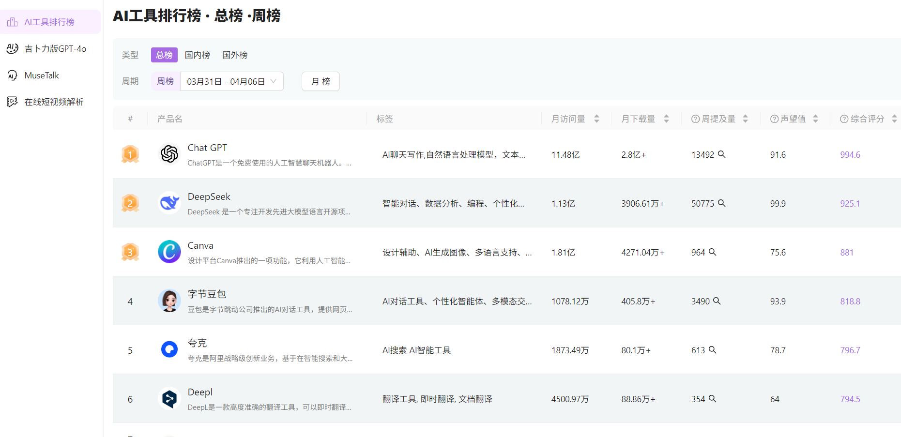

<!--
 * @Author: nevin
 * @Date: 2025-01-17 19:25:28
 * @LastEditTime: 2025-02-24 19:37:13
 * @LastEditors: nevin
 * @Description:
-->

# AiToEarn


[](https://nodejs.org/about/releases)

[English](README_EN.md) | 简体中文

## [最好用的开源内容营销AI Agent！](https://www.aitoearn.cn/aiToEarn)

AI内容制作，分发，出售。

## 里程碑
- 2025.2.26 发布0.1.1版本
- 2025.3.15 发布0.2.0版本
- 2025.4.18 发布0.6.0版本
- **[5月20日最新版本 0.8.0](https://github.com/yikart/AiToEarn/releases/tag/v0.8.0)**

## [常见问题](https://heovzp8pm4.feishu.cn/wiki/UksHwxdFai45SvkLf0ycblwRnTc?from=from_copylink)

## 具体功能介绍

- 视频、图文一键发布
 抖音
 小红书
 视频号
 快手
  - 支持Qwen大模型一键填写参数


- AI评论自动回复
  - 支持deepseek大模型
- AI评论截流
- AI评论搜索


- 实用AI工具
  - 支持可以画图的GPT-4o
  - 支持使用Musetalk制作数字人视频
  - 支持短视频平台视频下载
  - AI换脸
  - 声音克隆
  - 视频解说
  - 一键成片
  


- 账号数据汇总分析


- 全网热门内容观察
  - 小红书低粉爆文排行榜
  - 小红书，抖音，视频号，快手，bilibili，公众号分赛道热门内容排行榜
 
- AI工具排行榜

 

## 正在实现中
- MAC客户端实现
- Web端，APP端实现
- 内容安全审查（30%）
- 私信功能对接
- 公众号，bilibili发布实现
- 后端开源

## 快速开始
[直接下载最新版本0.8.0(windows)](https://github.com/yikart/AiToEarn/releases/download/v0.8.0/AiToEarn-0.8.0.exe)


```sh
# 克隆项目
git clone https://github.com/yikart/AttAiToEarn.git

# 进入目录
cd AttAiToEarn

# 安装依赖
npm i

# develop
npm run dev
```

## 上层框架

- vite官方 [template-react-ts](https://github.com/vitejs/vite/tree/main/packages/create-vite/template-react-ts)
- Electron + react [electron-vite-react](https://github.com/electron-vite/electron-vite-react)

## 目录

\_🚨 默认情况下, `electron` 文件夹下的文件将会被构建到 `dist-electron`

```tree
├── build                                    打包需要的一些文件
│
├── commont                                  渲染进程和系统进程共同需要的类型,常量等
│
├── electron                                 Electron 源码文件夹
│   ├── db                                   sqlite3 数据库
│   │   ├── migrations                       数据库迁移脚本文件
│   │   ├── models                           数据库实体文件
│   │   ├── scripts                          数据库脚本文件
│   │   └── index.ts                         数据库入口文件
│   ├── global                               渲染进程的全局变量
│   ├── main                                 主进程源码
│   │   ├── api                              业务接口api
│   │   ├── core                             仿nestjs的核心模块(依赖注入、装饰器实现等)
│   │   └── ...                              其他
│   ├── plat                                 三方平台的代码
│   ├── preload                              Preload-scripts 源码
│   ├── tray                                 系统托盘
│   └── util                                 工具
│
├── public                                   公共资源
│
├── scripts                                  构建脚本
│
├── release                                  构建后生成程序目录
│   └── {version}
│       ├── {os}-{os_arch}                   未打包的程序(绿色运行版)
│       └── {app_name}_{version}.{ext}       应用安装文件
│
├── public                                   同 Vite 模板的 public
└── src                                      渲染进程源码、React代码
```
## 其他说明
- 关于MAC打包,目前有bug,我们还在努力解决
- ```shell
   xattr -r -d com.apple.quarantine /Applications/哎呦赚AiToEarn.app
  ```

## 加我微信
辛苦备注一下 AiToEarn


## 友情链接
https://github.com/TMElyralab/MuseTalk

https://github.com/5ime/video_spider

https://github.com/FunAudioLLM/CosyVoice?tab=readme-ov-file

https://github.com/facefusion/facefusion

https://github.com/linyqh/NarratoAI

https://github.com/harry0703/MoneyPrinterTurbo

