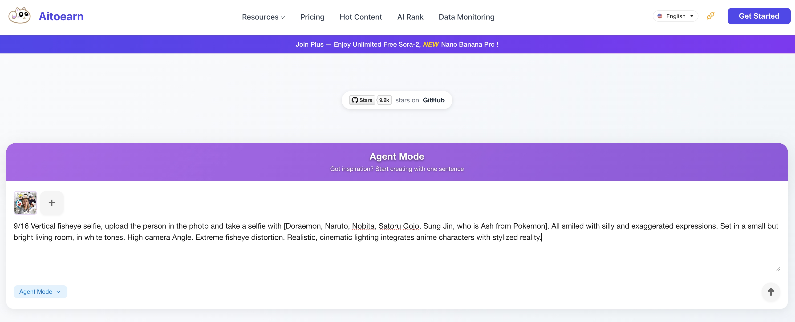
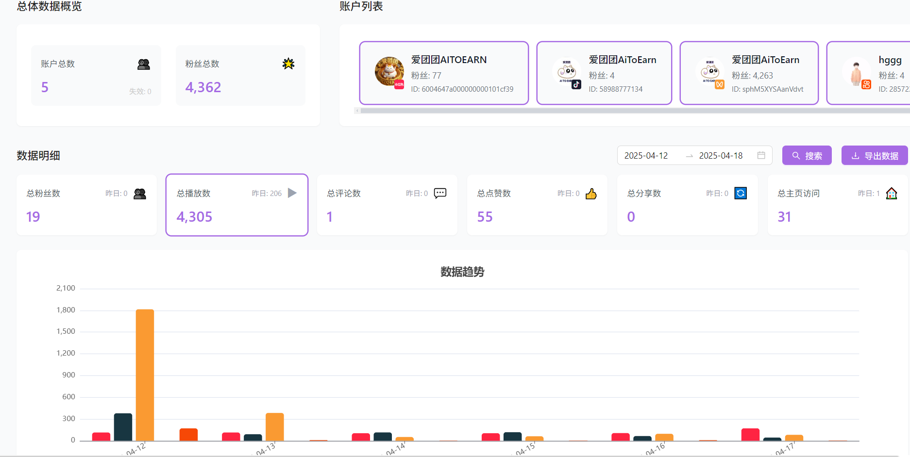

# [Aitoearn: The Best Open-Source AI Agent for Content Marketing](https://aitoearn.ai)

<a href="https://trendshift.io/repositories/20785" target="_blank"></a>


[](https://nodejs.org/about/releases)

English | [简体中文](README_CN.md)


**Create · Publish · Engage · Monetize — all in one platform.**

AiToEarn helps creators, brands, and businesses build, distribute, and monetize content with **AI-powered automation** across the world’s most popular platforms.

Supported Channels:
Douyin, Xiaohongshu (Rednote), WeChat Channels, Kuaishou, Bilibili, WeChat Official Accounts,
TikTok, YouTube, Facebook, Instagram, Threads, Twitter (X), Pinterest, LinkedIn

## 🎥 Demo Video
<a href="https://youtu.be/y900LxIrZT4">
  
</a>


[](https://www.youtube.com/watch?v=5041jEKaiU8)

## What's new:
* 2025.02.07: [1.8.0 version](https://www.aitoearn.ai/), we introduced support for offline business scenarios, covering restaurants, retail stores, hotels and guesthouses, beauty and hair salons, gyms, and other types of physical businesses. This feature transforms offline promotional activities into executable online distribution tasks. Through content publishing and user participation mechanisms, it helps businesses gain more online exposure and in-store traffic.
* 2025.01.06 : [1.5.3 version](https://www.aitoearn.ai/en), deal with lots of issue
* 2025.12.15 : "All In Agent" arrives! We've introduced a super AI agent that can automatically generate and publish content, and help you operate AiToEarn. [v1.4.3](https://github.com/yikart/AiToEarn/releases/tag/v1.4.3)

* 2025.11.28 : Support automatic updates within the application. Add a large number of AI functions to the creation interface, such as abbreviation, expansion, image creation, video creation, tag generation, etc., supporting Nano Banana Pro.[v1.4.0](https://github.com/yikart/AiToEarn/releases/tag/v1.4.0)
* 2025.11.12 : The first open-source, fully usable version,[v1.3.2](https://github.com/yikart/AiToEarn/releases/tag/v1.3.2)

<details>
  <summary><h2 style="display:inline;margin:0">Table of Contents</h2></summary>
  
  <br/>
  
  1. [Quick Start for Creators (Apps & Web)](#quick-start-for-creators)
  3. [Key Features](#key-features)
  4. [Quick Start for Developers (Docker, Recommended)](#quick-start-for-developers-docker-recommended)
  5. [MCP Service](#mcp-service)
  7. [Contact](#contact)
  9. [FAQ](#faq)
  10. [Recommended](#recommended)
</details>


## [Quick Start for Creators](https://aitoearn.ai/)


## Key Features

🚀 **AiToEarn is a full-stack AI-powered content growth & monetization platform.**
From creative ideas, to multi-channel publishing, to analytics & monetization — AiToEarn helps you truly **Create · Publish · Engage · Monetize.**

### Agent — AI Assistant
- **All In Agent**: Let the AI agent help you create and publish content, assisting you in operating AiToEarn.

<div style="display: flex; justify-content: space-around;">
  
</div>


### 1. Content Publishing — One-Click Multi-Platform

* **Distribute Everywhere**: Publish to the widest range of global platforms (Douyin, Kwai, WeChat Channels, WeChat Offical Account, Bilibili, Rednote, Facebook, Instagram, TikTok, LinkedIn, Threads, YouTube, Pinterest, x(Twitter)).
* **Smart Import**: Import historical content for fast re-editing & redistribution.

  * Example: Sync your Xiaohongshu posts to YouTube in one click.
* **Calendar Scheduler**: Plan & coordinate content like a calendar across all platforms.
<div style="display: flex; justify-content: space-around;">
  
  
</div>

### 2. Content Hotspot — Viral Inspiration Engine

* **Case Library**: Explore how others create posts with 10,000+ likes.
* **Trend Radar**: Discover the latest viral trends instantly, reduce creator anxiety.
<div style="display: flex; justify-content: space-around;">
  
  
  
  
</div>

### 3. Content Search — Brand & Market Insights

* **Brand Monitoring**: Track conversations about your brand in real-time.
* **Content Discovery**: Search for posts, topics, and communities for targeted engagement.

<div style="display:flex; justify-content:space-between; align-items:center;">
  
  
  
  
</div>


### 4. Comments Search — Precision User Mining

* **Smart Comment Search**: Detect high-conversion signals like “link please” or “how to buy.”
* **Conversion Booster**: Reply instantly, drive higher engagement & sales.
 <div style="display:flex; justify-content:space-between; align-items:center;">
  
  
</div>

### 5. Content Engagement — Growth Engine

* **Unified Dashboard**: Manage all interactions in one place.
* **Proactive Engagement**: Join trending conversations, connect with potential customers.
* Turn **passive operations** into **active traffic growth.**

 <div style="display:flex; justify-content:space-between; align-items:center;">
  
</div>

### 6. Content Analytics — Full-Funnel Data

* **Cross-Platform Comparison**: One platform may block traffic, but others won’t.
* **End-to-End Monitoring**: Track performance and build your path to 1M+ followers.



### 7. (Coming Soon) AI Content Creation — End-to-End Assistant

* **AI Copywriting**: Auto-generate titles, captions & descriptions.
* **AI Commenting**: Engage proactively, attract traffic.
* **Image & Card Generator**: Speed up content workflows.
* **Supported AI Video Models**: Seedance, Kling, Hailuo, Veo, Medjourney, Sora, Pika, Runway.
* **Supported AI Image Models**: GPT, Flux.
* **Next**: Tag generator, smart DMs, video editing, AI avatars, translation for global distribution.


### 8. (Coming Soon) Content Marketplace — Trade & Monetize

* **Creators**: Sell your content directly, find buyers fast.
* **Brands**: Purchase ready-made, high-quality content.
* **AI-Powered Growth**:
  **Let’s use AI to earn. Let’s earn money together!**

## Quick Start for Developers (Docker, Recommended)

This is the easiest way to run AiToEarn. It will start the **frontend, backend, MongoDB and Redis** with one command.  
You **do NOT** need to install MongoDB or Redis on your machine manually.

```bash
git clone https://github.com/yikart/AiToEarn.git
cd AiToEarn
docker compose up -d
```


### 🌐 Access Applications

After Docker starts successfully, you can access services at:

| Service              | URL                                              | Description                          |
| -------------------- | ------------------------------------------------ | ------------------------------------ |
| **Web Frontend**     | [http://localhost:8080](http://localhost:8080)    | Web user interface (via Nginx)       |
| **Backend API**      | [http://localhost:8080/api](http://localhost:8080/api) | AiToEarn backend API (via Nginx) |
| **RustFS Console**   | [http://localhost:9001](http://localhost:9001)    | Object storage management console    |
| **MongoDB**          | localhost:27017                                   | MongoDB database                     |
| **Redis**            | localhost:6379                                    | Redis cache                          |

> ℹ️ All services (MongoDB, Redis, RustFS, Nginx, etc.) are started by `docker compose`. No extra local installation is required.


### 🧩 Advanced Configuration

All service configurations (passwords, API keys, domain settings, etc.) are managed directly in `docker-compose.yml` and the config files under the `config/` directory.

For detailed deployment instructions, see [DOCKER_DEPLOYMENT_EN.md](DOCKER_DEPLOYMENT_EN.md).


<details>
<summary>🧪 Optional: Run backend & frontend manually (dev mode)</summary>

This mode is mainly for local development & debugging.
You can still use Docker for MongoDB/Redis, or configure your own services in the config files.

#### 1. Start the backend services

```bash
cd project/aitoearn-backend
pnpm install
# Copy config files for local development
cp apps/aitoearn-ai/config/config.js apps/aitoearn-ai/config/local.config.js
cp apps/aitoearn-server/config/config.js apps/aitoearn-server/config/local.config.js
pnpm nx serve aitoearn-ai
# in another terminal
pnpm nx serve aitoearn-server
```

#### 2. Start the frontend `aitoearn-web`

```bash
pnpm install
pnpm run dev
```

</details>


<details>
<summary>🖥️ Optional: Start Electron desktop project</summary>

```bash
# Clone the repo
git clone https://github.com/yikart/AttAiToEarn.git

# Enter directory
cd AttAiToEarn

# Install dependencies
npm i

# Compile sqlite (better-sqlite3 requires node-gyp and local Python)
npm run rebuild

# Start development
npm run dev
```

The Electron project provides a desktop client for AiToEarn.

</details>

## MCP Service

AiToEarn provides MCP (Model Context Protocol) server endpoints that allow AI assistants (such as Claude, Cursor, etc.) to interact with your AiToEarn instance programmatically — including publishing content, managing accounts, and more.

### Endpoints

AiToEarn exposes two MCP transport protocols:

| Transport | Endpoint | Description |
|-----------|----------|-------------|
| **HTTP** | `{baseUrl}/api/unified/mcp` | Recommended. Stateless HTTP-based MCP transport |
| **SSE** | `{baseUrl}/api/unified/sse` | Server-Sent Events transport for long-lived connections |

### Quick Setup

1. Go to **Settings → API Key** in the AiToEarn web interface and create an API Key.
2. Configure your AI assistant's MCP client to connect to one of the endpoints above, passing your API Key via the `x-api-key` header.

**Example for Claude Desktop** (`claude_desktop_config.json`):

```json
{
  "mcpServers": {
    "aitoearn": {
      "type": "http",
      "url": "https://aitoearn.ai/api/unified/mcp",
      "headers": {
        "x-api-key": "your-api-key"
      }
    }
  }
}
```

> For self-hosted instances, replace the URL with your own (e.g., `http://localhost:8080/api/unified/mcp`).

## Relay Service

Relay enables self-hosted AiToEarn instances to connect social media platform accounts via the official AiToEarn relay server (`https://aitoearn.ai`), without needing to configure OAuth credentials for each platform yourself.

### How It Works

1. Your self-hosted instance sends OAuth requests through the relay server.
2. Users authorize on the platform via the relay server's OAuth credentials.
3. The relay server forwards the authorization result back to your instance via the callback URL.

### Setup

1. Go to **Settings → API Key** on [https://aitoearn.ai](https://aitoearn.ai) and create an API Key.
2. Configure the following environment variables in your `docker-compose.yml` under the `aitoearn-server` service:

```yaml
RELAY_SERVER_URL: https://aitoearn.ai/api
RELAY_API_KEY: your-api-key
RELAY_CALLBACK_URL: http://127.0.0.1:8080/api/plat/relay-callback
```

3. Restart the service: `docker compose restart aitoearn-server`

## Contact
https://t.me/harryyyy2025


## [FAQ](https://heovzp8pm4.feishu.cn/wiki/UksHwxdFai45SvkLf0ycblwRnTc?from=from_copylink)


## Recommended

* [https://github.com/TMElyralab/MuseTalk](https://github.com/TMElyralab/MuseTalk)
* [https://github.com/5ime/video\_spider](https://github.com/5ime/video_spider)
* [https://github.com/FunAudioLLM/CosyVoice?tab=readme-ov-file](https://github.com/FunAudioLLM/CosyVoice?tab=readme-ov-file)
* [https://github.com/facefusion/facefusion](https://github.com/facefusion/facefusion)
* [https://github.com/linyqh/NarratoAI](https://github.com/linyqh/NarratoAI)
* [https://github.com/harry0703/MoneyPrinterTurbo](https://github.com/harry0703/MoneyPrinterTurbo)


