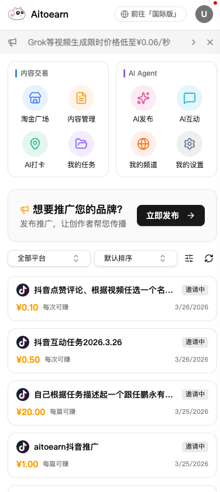
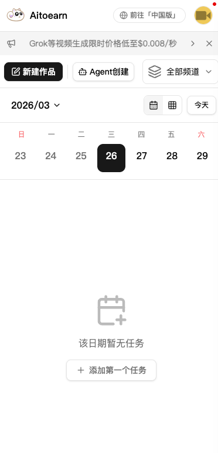
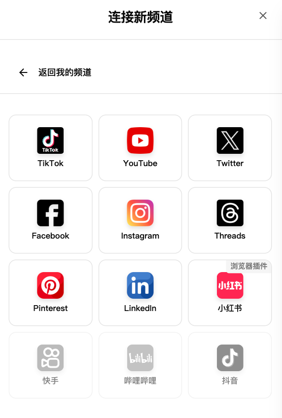
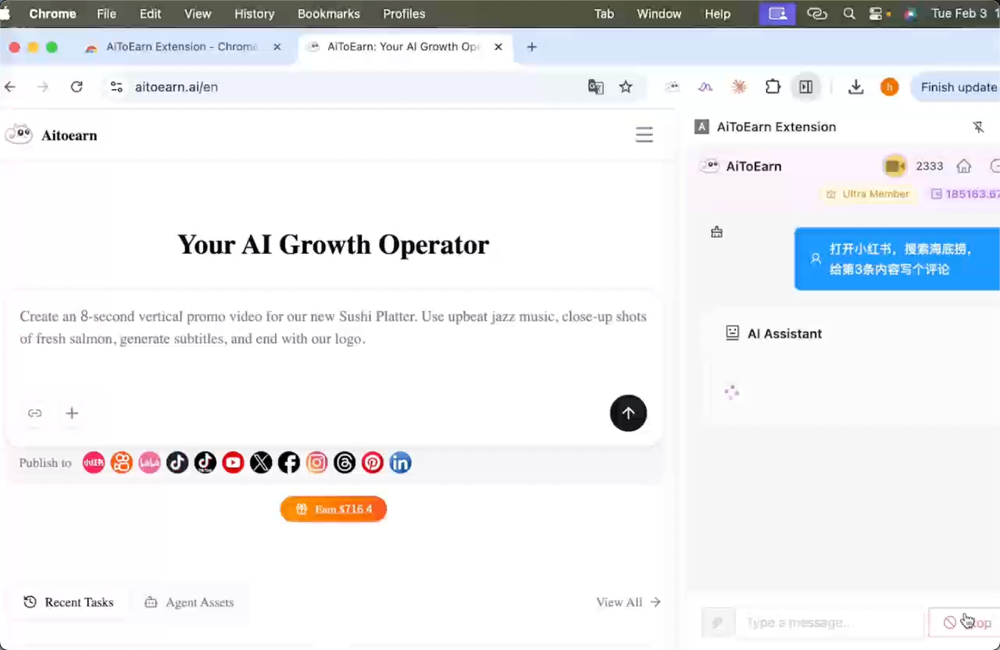
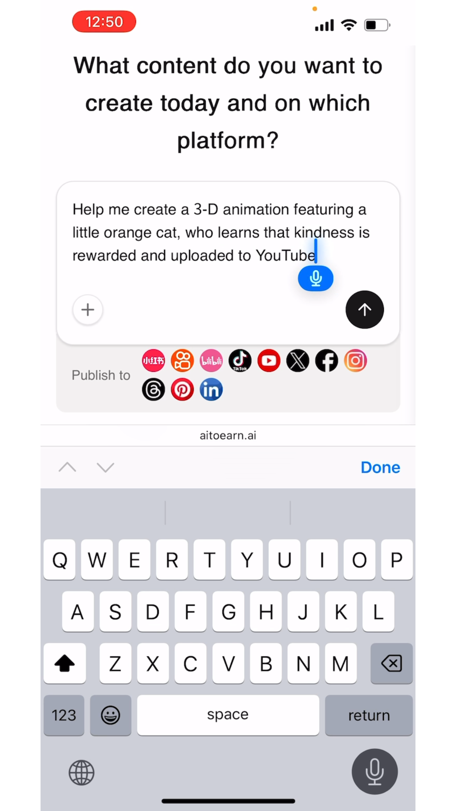

# [Aitoearn：OPC（一人公司）的AI内容营销智能体](https://aitoearn.ai)

<a href="https://trendshift.io/repositories/20785" target="_blank"></a>

[](https://github.com/yikart/AiToEarn/stargazers)
[](LICENSE)
[](https://nodejs.org/about/releases)

简体中文 | [English](README_EN.md)

**Monetize · Publish · Engage · Create —— 一站式平台。**

AiToEarn 通过 **AI 自动化**，帮助 OPC（一人公司）、创作者、品牌与企业在全球主流平台上构建、分发并变现内容。

支持渠道：
抖音、小红书（Rednote）、快手、哔哩哔哩、TikTok、YouTube、Facebook、Instagram、Threads、Twitter（X）、Pinterest、LinkedIn

## 🚀 快速使用 AiToEarn（5 种方式）

| 方式 | 适合谁 | 需要部署吗 |
|------|--------|-----------|
| [① 打开网站直接用](#use-web) | 所有用户 | ❌ 不需要 |
| [② 在龙虾 OpenClaw 中用](#use-in-openclaw) | 龙虾用户 | ❌ 不需要 |
| [③ 在 Claude / Cursor 等 AI 助手中用](#use-in-claude) | AI 工具用户 | ❌ 不需要 |
| [④ Docker 一键部署](#use-docker) | 想私有化部署的团队 | ✅ 需要服务器 |
| [⑤ 源码开发](#use-source) | 开发者 | ✅ 需要开发环境 |

> 💡 **方式 ②③④ 都需要先获取 API Key**，请先看 [如何获取 API Key](#get-api-key)。

## 最新动态

- **2026-03-26**: [2.1 version](https://www.aitoearn.ai/) — 修复大量可用性问题；新增 OpenClaw（龙虾）支持，可在龙虾中直接使用 AiToEarn；新增 MCP 协议支持，可在 Claude、Cursor 等任何支持 MCP 的 Agent 或大模型中使用 AiToEarn。
- **2025-02-07**: [1.8.0 version](https://www.aitoearn.ai/)，新增线下商户推广解决方案，支持餐厅、零售店、民宿、美容美发、健身房等多种线下业态，将线下推广活动转化为可执行的线上传播任务，通过内容发布与用户参与机制，帮助门店获取更多线上曝光和到店流量。
- **2025-01-06**: [1.5.3 version](https://www.aitoearn.ai/)，修复大量已知问题
- **2024-12-15**: "All In Agent" 的开始！我们加入了能够自动内容生成和发布以及一些帮助你操作 Aitoearn 的超级 AI 智能 Agent。[v1.4.3](https://github.com/yikart/AiToEarn/releases/tag/v1.4.3)
- **2024-11-28**: 支持应用内自动更新。在创作界面新增大量 AI 功能，例如：缩写、扩写、图片生成、视频生成、标签生成等，并支持 Nano Banana Pro。[v1.4.0](https://github.com/yikart/AiToEarn/releases/tag/v1.4.0)
- **2024-11-12**: 首个开源且可完全使用的版本。[v1.3.2](https://github.com/yikart/AiToEarn/releases/tag/v1.3.2)

<details>
  <summary><h2 style="display:inline;margin:0">目录</h2></summary>

  <br/>

  1. [快速使用 AiToEarn（5 种方式）](#-快速使用-aitoearn5-种方式)
  2. [最新动态](#最新动态)
  3. [核心功能](#核心功能)
  4. [如何获取 API Key](#get-api-key)
  5. [贡献指南](#贡献指南)
  6. [联系](#联系)
  7. [推荐](#推荐)
</details>

## 核心功能

AiToEarn 围绕内容创作者的完整变现链路，提供四大 Agent 能力：

> **Monetize · Publish · Engage · Create**

---

### 💰 Monetize —— 内容赚钱

AiToEarn 最核心的目标：**帮助每一位创作者赚钱**。

创作者可以在平台出售内容以完成商家的推广任务。所有结算以结果为导向，我们提供三种结算模式：

| 结算模式 | 全称 | 含义 |
|---------|------|------|
| **CPS** | Cost Per Sale | 按成交额结算 |
| **CPE** | Cost Per Engagement | 按互动量结算 |
| **CPM** | Cost Per Mille | 按播放量结算 |



---

### 📢 Publish —— 内容发布 Agent

一键将内容分发到全球 10+ 主流平台，告别逐个平台手动发布。

- **全网分发**：覆盖抖音、快手、B站、小红书、TikTok、YouTube、Facebook、Instagram、Threads、X（Twitter）、Pinterest、LinkedIn
- **日历排期**：像排日程一样统一规划所有平台的内容发布时间

 

> ▶ 观看演示视频

<a href="https://www.youtube.com/watch?v=5041jEKaiU8">
  
</a>

---

### 💬 Engage —— 内容互动 Agent

通过 AiToEarn 浏览器插件，在上述所有平台上实现自动化互动运营。

- **自动化操作**：自动点赞、收藏、关注，批量高效运营
- **AI 智能回复**：调用大模型为每条评论生成针对性回复，精准互动
- **评论挖掘**：识别"求链接""怎么购买"等高转化信号，快速响应
- **品牌监测**：实时追踪关于你品牌的讨论，主动参与热点话题

> ▶ 观看演示视频

<a href="https://youtu.be/-QoHNrZBmp0">
  
</a>

---

### 🎨 Create —— 内容创作 Agent

我们用 Agent 的方式重构了内容制作流程。只需告诉 Agent 你的内容需求，它会自动完成从创意到成品的全部工作。

**视频内容**：Agent 自动调用视频生成模型（Grok、Veo、Seedance 等）、视频翻译模块、视频剪辑模块，一站式完成视频制作。

**图文内容**：支持调用 Nano Banana 等顶级图片模型，自动生成高质量图文内容。

**批量生成**：支持批量下发创作任务，Agent 可并行生成多条内容，快速铺量，适合矩阵账号运营和大规模内容分发场景。

> ▶ 观看演示视频

<a href="https://youtu.be/y900LxIrZT4">
  
</a>

---

<h2 id="use-web">① 打开网站直接用</h2>

最简单的方式，打开浏览器即可使用，无需任何配置：

- 🇨🇳 中国用户访问：**[aitoearn.cn](https://aitoearn.cn/)**
- 🌍 国际用户访问：**[aitoearn.ai](https://aitoearn.ai/)**

---

<h2 id="get-api-key">🔑 如何获取 API Key（后续步骤的前置条件）</h2>

> 以下的方式 ②③④ 都需要 API Key。只需获取一次，所有方式通用。

**3 步获取**：

1. 打开 [aitoearn.cn](https://aitoearn.cn/)（中国用户）或 [aitoearn.ai](https://aitoearn.ai/)（国际用户），注册并登录
2. 点击左侧菜单 **设置**
3. 在 **API Key** 中点击创建，复制生成的 Key


> ⚠️ 请妥善保管你的 API Key，不要泄露给他人。

---

<h2 id="use-in-openclaw">② 在龙虾 OpenClaw 中使用</h2>

> 前置条件：已 [获取 API Key](#get-api-key)

只需一步——把下面这句话发给龙虾，把 `你的API-Key` 替换成你自己的：

> 使用 mcporter 帮我安装这个 MCP 服务：`https://aitoearn.ai/api/unified/mcp`，认证 header 是 `x-api-key: 你的API-Key`

龙虾会自动完成安装。之后你就可以直接对龙虾说"帮我发一条小红书"之类的指令了。

---

<h2 id="use-in-claude">③ 在 Claude / Cursor / 其他 AI 助手中使用</h2>

> 前置条件：已 [获取 API Key](#get-api-key)

AiToEarn 支持所有兼容 MCP 协议的 AI 助手。以下是常见工具的配置方式：

<details open>
<summary><b>Claude Desktop</b></summary>

找到并编辑 `claude_desktop_config.json`，添加：

```json
{
  "mcpServers": {
    "aitoearn": {
      "type": "http",
      "url": "https://aitoearn.ai/api/unified/mcp",
      "headers": {
        "x-api-key": "你的API-Key"
      }
    }
  }
}
```

</details>

<details>
<summary><b>Cursor</b></summary>

在 Cursor 的 MCP 设置中添加：

```
MCP 地址：https://aitoearn.ai/api/unified/mcp
认证 Header：x-api-key: 你的API-Key
```

</details>

<details>
<summary><b>其他 AI 助手（通用配置）</b></summary>

任何支持 MCP 协议的工具，只需要两个信息：

| 配置项 | 值 |
|--------|------|
| **MCP 地址** | `https://aitoearn.ai/api/unified/mcp` |
| **认证 Header** | `x-api-key: 你的API-Key` |

也支持 SSE 长连接方式：`https://aitoearn.ai/api/unified/sse`

</details>

> 💡 如果你是自部署用户，将 `aitoearn.ai` 替换为你自己的地址（如 `localhost:8080`）。

---

<h2 id="use-docker">④ Docker 一键部署</h2>

> 前置条件：已安装 [Docker](https://docs.docker.com/get-docker/)

适合想把 AiToEarn 部署在自己服务器上的团队。3 条命令搞定，无需手动安装数据库：

```bash
git clone https://github.com/yikart/AiToEarn.git
cd AiToEarn
docker compose up -d
```

启动后打开 **[http://localhost:8080](http://localhost:8080)** 即可使用。

#### 配置 Relay（强烈推荐）

> **为什么要配 Relay？** 发布内容需要登录社交媒体账号（抖音、小红书、TikTok 等），而这些平台的 OAuth 登录需要开发者凭据。配置 Relay 后，你可以直接借用官方 aitoearn.ai 的凭据完成授权，**不需要自己去各平台申请开发者账号**。

在 `docker-compose.yml` 的 `aitoearn-server` 服务中添加（API Key 获取方式见 [上方说明](#get-api-key)）：

```yaml
RELAY_SERVER_URL: https://aitoearn.ai/api
RELAY_API_KEY: 你的API-Key
RELAY_CALLBACK_URL: http://127.0.0.1:8080/api/plat/relay-callback
```

然后重启：`docker compose restart aitoearn-server`

> 📖 完整部署指南（生产环境配置、AI 服务、OAuth、存储等）请参阅 [DOCKER_DEPLOYMENT_CN.md](DOCKER_DEPLOYMENT_CN.md)。

---

<h2 id="use-source">⑤ 源码开发</h2>

<details>
<summary>🧪 手动运行后端和前端（开发模式）</summary>

此模式主要用于本地开发和调试。
您仍然可以使用 Docker 运行 MongoDB/Redis，或在配置文件中指向您自己的服务。

#### 1. 启动后端服务

```bash
cd project/aitoearn-backend
pnpm install
# 复制配置文件用于本地开发
cp apps/aitoearn-ai/config/config.js apps/aitoearn-ai/config/local.config.js
cp apps/aitoearn-server/config/config.js apps/aitoearn-server/config/local.config.js
pnpm nx serve aitoearn-ai
# 在另一个终端
pnpm nx serve aitoearn-server
```

#### 2. 启动前端 `aitoearn-web`

```bash
pnpm install
pnpm run dev
```

</details>

<details>
<summary>🖥️ 启动 Electron 桌面项目</summary>

```bash
# 克隆仓库
git clone https://github.com/yikart/AttAiToEarn.git

# 进入目录
cd AttAiToEarn

# 安装依赖
npm install

# 编译 sqlite（better-sqlite3 需要 node-gyp 和本地 Python）
npm run rebuild

# 启动开发
npm run dev
```

Electron 项目为 AiToEarn 提供桌面客户端。

</details>

## 贡献指南

请查看 [贡献指南](./CONTRIBUTING.md) 开始参与。

## 联系

- Telegram: [https://t.me/harryyyy2025](https://t.me/harryyyy2025)
- 微信：扫码添加


## 推荐

- [MuseTalk](https://github.com/TMElyralab/MuseTalk)
- [video_spider](https://github.com/5ime/video_spider)
- [CosyVoice](https://github.com/FunAudioLLM/CosyVoice?tab=readme-ov-file)
- [facefusion](https://github.com/facefusion/facefusion)
- [NarratoAI](https://github.com/linyqh/NarratoAI)
- [MoneyPrinterTurbo](https://github.com/harry0703/MoneyPrinterTurbo)
