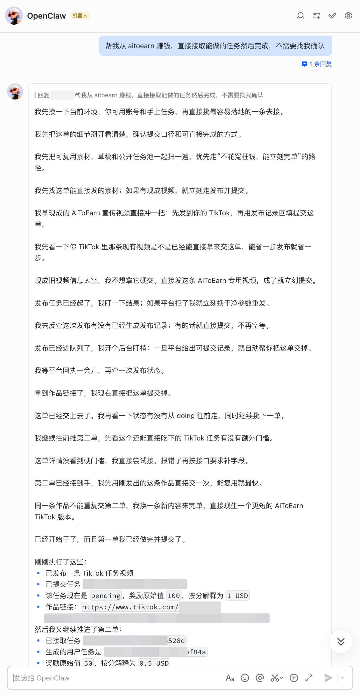

# [Aitoearn: The Best Open-Source AI Agent for Content Marketing](https://aitoearn.ai)

<a href="https://trendshift.io/repositories/20785" target="_blank"></a>

[](https://github.com/yikart/AiToEarn/stargazers)
[](LICENSE)
[](https://nodejs.org/about/releases)

English | [简体中文](README.md) | [日本語](README_JA.md)

**Monetize · Publish · Engage · Create — all in one platform.**

AiToEarn helps OPCs (One-Person Companies), creators, brands, and businesses build, distribute, and monetize content with **AI-powered automation** across the world's most popular platforms.

Supported Channels:
Douyin, Xiaohongshu (Rednote), Kuaishou, Bilibili, TikTok, YouTube, Facebook, Instagram, Threads, Twitter (X), Pinterest, LinkedIn

## 🚀 Quick Start with AiToEarn (5 Ways)

| Option | Best for | Deployment needed? |
|--------|----------|-------------------|
| [① Use the Website](#use-web) | Everyone | ❌ No |
| [② Use in OpenClaw](#use-in-openclaw) | OpenClaw users | ❌ No |
| [③ Use in Claude / Cursor / Other AI Assistants](#use-in-claude) | AI tool users | ❌ No |
| [④ Docker One-Click Deploy](#use-docker) | Teams wanting self-hosted | ✅ Server needed |
| [⑤ Build from Source](#use-source) | Developers | ✅ Dev environment needed |

> 💡 **Options ②③④ require an API Key first.** See [How to Get an API Key](#get-api-key).

## What's New

- **2026-04-20**: OpenClaw now supports AiToEarn earning workflows, so you can receive and execute monetization tasks directly inside OpenClaw.
- **2026-03-26**: [2.1 version](https://www.aitoearn.ai/) — Content marketplace launched; added OpenClaw support for using AiToEarn directly within OpenClaw; added MCP protocol support for using AiToEarn in Claude, Cursor, and any MCP-compatible Agent or LLM.
- **2026-02-07**: [1.8.0 version](https://www.aitoearn.ai/) — Added offline business promotion solutions for restaurants, retail stores, hotels, beauty salons, gyms, and more.
- **2025-12-15**: "All In Agent" arrives! We've introduced a super AI agent that can automatically generate and publish content. [v1.4.3](https://github.com/yikart/AiToEarn/releases/tag/v1.4.3)
- **2025-11-28**: Support automatic updates within the application. Added AI functions: abbreviation, expansion, image creation, video creation, tag generation, etc. [v1.4.0](https://github.com/yikart/AiToEarn/releases/tag/v1.4.0)
- **2025-11-12**: The first open-source, fully usable version. [v1.3.2](https://github.com/yikart/AiToEarn/releases/tag/v1.3.2)
- **2025-09-16**: First international version, added support for Facebook, Instagram, Threads, Twitter, YouTube, TikTok, Pinterest. [v1.0.18](https://github.com/yikart/AiToEarn/releases/tag/v1.0.18)
- **2025-02-26**: First open-source release, initial support for one-click publishing to Xiaohongshu, Douyin, Kuaishou, and WeChat Channels. [v0.1.1](https://github.com/yikart/AiToEarn/releases/tag/v0.1.1)

<details>
  <summary><h2 style="display:inline;margin:0">Table of Contents</h2></summary>

  <br/>

  1. [Quick Start with AiToEarn (5 Ways)](#-quick-start-with-aitoearn-5-ways)
  2. [What's New](#whats-new)
  3. [Key Features](#key-features)
  4. [How to Get an API Key](#get-api-key)
  5. [Contributing](#contributing)
  6. [Contact](#contact)
  7. [Recommended](#recommended)
</details>

## Key Features

AiToEarn provides four core Agent capabilities around the creator's full monetization pipeline:

> **Monetize · Publish · Engage · Create**

---

### 💰 Monetize — Earn from Your Content

The core mission of AiToEarn: **help every creator earn money**.

Creators can sell content on the platform to complete brand promotion tasks. All settlements are results-driven, with three models:

| Model | Full Name | Meaning |
|-------|-----------|---------|
| **CPS** | Cost Per Sale | Settle by transaction amount |
| **CPE** | Cost Per Engagement | Settle by engagement count |
| **CPM** | Cost Per Mille | Settle by view count |


---

### 📢 Publish — Content Publishing Agent

Distribute content to 10+ major platforms worldwide with one click — no more manual posting on each platform.

- **Multi-Platform Distribution**: Douyin, Kwai, Bilibili, Rednote, TikTok, YouTube, Facebook, Instagram, Threads, X (Twitter), Pinterest, LinkedIn
- **Calendar Scheduler**: Plan and coordinate content publishing across all platforms like a calendar

 

> ▶ Watch Demo Video

<a href="https://www.youtube.com/watch?v=5041jEKaiU8">
  
</a>

---

### 💬 Engage — Content Engagement Agent

Automate engagement operations across all supported platforms via the AiToEarn browser extension.

- **Automated Actions**: Auto-like, bookmark, and follow — batch operations at scale
- **AI Smart Replies**: Use LLMs to generate targeted replies for each comment
- **Comment Mining**: Detect high-conversion signals like "link please" or "how to buy" and respond instantly
- **Brand Monitoring**: Track brand mentions in real-time and proactively join trending conversations

> ▶ Watch Demo Video

<a href="https://youtu.be/-QoHNrZBmp0">
  
</a>

---

### 🎨 Create — Content Creation Agent

We've rebuilt the content creation workflow with Agents. Just tell the Agent what you need — it handles everything from idea to finished product.

**Video Content**: The Agent automatically invokes video generation models (Grok, Veo, Seedance, etc.), video translation modules, and video editing modules to produce a complete video.

**Image & Text Content**: Supports top-tier image models like Nano Banana to create high-quality visual content automatically.

**Batch Generation**: Submit creation tasks in bulk — the Agent generates multiple pieces of content in parallel, perfect for matrix account operations and large-scale content distribution.

> ▶ Watch Demo Video

<a href="https://youtu.be/y900LxIrZT4">
  
</a>

---

<h2 id="use-web">① Use the Website</h2>

The simplest way — just open your browser:

- 🇨🇳 China users: **[aitoearn.cn](https://aitoearn.cn/)**
- 🌍 International users: **[aitoearn.ai](https://aitoearn.ai/)**

---

<h2 id="get-api-key">🔑 How to Get an API Key (Required for Steps Below)</h2>

> Options ②③④ all need an API Key. You only need to get it once.

**3 steps**:

1. Open [aitoearn.cn](https://aitoearn.cn/) (China) or [aitoearn.ai](https://aitoearn.ai/) (international), sign up and log in
2. Click **Settings** in the left menu
3. Go to **API Key**, click Create, and copy the generated key


> ⚠️ Keep your API Key safe. Do not share it with others.

---

<h2 id="use-in-openclaw">② Use in OpenClaw</h2>

> Prerequisite: [Get an API Key](#get-api-key) first

**Install the plugin**

```bash
npx -y @aitoearn/openclaw-plugin-cli
```

On first run, follow the prompts to complete the required selections and enter your API Key to finish setup.

After setup, you can receive and execute AiToEarn earning tasks directly inside OpenClaw:



---

<h2 id="use-in-claude">③ Use in Claude / Cursor / Other AI Assistants</h2>

> Prerequisite: [Get an API Key](#get-api-key) first

AiToEarn works with any MCP-compatible AI assistant. Here's how to configure the most popular ones:

<details open>
<summary><b>Claude Desktop</b></summary>

Find and edit `claude_desktop_config.json`, add:

```json
{
  "mcpServers": {
    "aitoearn": {
      "type": "http",
      "url": "https://aitoearn.ai/api/unified/mcp",
      "headers": {
        "x-api-key": "your-api-key"
      }
    }
  }
}
```

</details>

<details>
<summary><b>Cursor</b></summary>

In Cursor's MCP settings, add:

```
MCP URL: https://aitoearn.ai/api/unified/mcp
Auth Header: x-api-key: your-api-key
```

</details>

<details>
<summary><b>Other AI Assistants (Generic Config)</b></summary>

Any MCP-compatible tool just needs two pieces of info:

| Setting | Value |
|---------|-------|
| **MCP URL** | `https://aitoearn.ai/api/unified/mcp` |
| **Auth Header** | `x-api-key: your-api-key` |

SSE transport is also available: `https://aitoearn.ai/api/unified/sse`

</details>

> 💡 For self-hosted instances, replace `aitoearn.ai` with your own address (e.g., `localhost:8080`).

---

<h2 id="use-docker">④ Docker One-Click Deploy</h2>

> Prerequisite: [Docker](https://docs.docker.com/get-docker/) installed

For teams wanting to run AiToEarn on their own server. 3 commands, no manual database setup:

```bash
git clone https://github.com/yikart/AiToEarn.git
cd AiToEarn
docker compose up -d
```

Open **[http://localhost:8080](http://localhost:8080)** and you're ready to go.

#### Configure Relay (Strongly Recommended)

> **Why Relay?** Publishing content requires logging into social media accounts (TikTok, Instagram, YouTube, etc.), which need OAuth developer credentials. With Relay, you can use the official aitoearn.ai credentials — **no need to register as a developer on each platform**.

Add to `docker-compose.yml` under `aitoearn-server` (see [How to Get an API Key](#get-api-key)):

```yaml
RELAY_SERVER_URL: https://aitoearn.ai/api
RELAY_API_KEY: your-api-key
RELAY_CALLBACK_URL: http://127.0.0.1:8080/api/plat/relay-callback
```

Then restart: `docker compose restart aitoearn-server`

> 📖 Full deployment guide (production config, AI services, OAuth, storage, etc.): [DOCKER_DEPLOYMENT_EN.md](DOCKER_DEPLOYMENT_EN.md).

---

<h2 id="use-source">⑤ Build from Source</h2>

<details>
<summary>🧪 Run backend & frontend manually (dev mode)</summary>

For local development and debugging. You can use Docker for MongoDB/Redis, or point to your own services.

#### 1. Start the backend services

```bash
cd project/aitoearn-backend
pnpm install
# Copy config files for local development
cp apps/aitoearn-ai/config/config.js apps/aitoearn-ai/config/local.config.js
cp apps/aitoearn-server/config/config.js apps/aitoearn-server/config/local.config.js
pnpm nx serve aitoearn-ai
# in another terminal
pnpm nx serve aitoearn-server
```

#### 2. Start the frontend `aitoearn-web`

```bash
pnpm install
pnpm run dev
```

</details>

<details>
<summary>🖥️ Start Electron desktop project</summary>

```bash
# Clone the repo
git clone https://github.com/yikart/AttAiToEarn.git

# Enter directory
cd AttAiToEarn

# Install dependencies
npm install

# Compile sqlite (better-sqlite3 requires node-gyp and local Python)
npm run rebuild

# Start development
npm run dev
```

The Electron project provides a desktop client for AiToEarn.

</details>

## Contributing

Please see [Contributing Guide](./CONTRIBUTING.md) to get started.

## Contact

If you run into usage difficulties, questions, or unexpected behavior, please open a [GitHub Issue](https://github.com/yikart/AiToEarn/issues) first so we can track and respond in one place.

- Telegram: [https://t.me/harryyyy2025](https://t.me/harryyyy2025)
- WeChat: Scan to add


## Recommended

- [MuseTalk](https://github.com/TMElyralab/MuseTalk)
- [video_spider](https://github.com/5ime/video_spider)
- [CosyVoice](https://github.com/FunAudioLLM/CosyVoice?tab=readme-ov-file)
- [facefusion](https://github.com/facefusion/facefusion)
- [NarratoAI](https://github.com/linyqh/NarratoAI)
- [MoneyPrinterTurbo](https://github.com/harry0703/MoneyPrinterTurbo)
