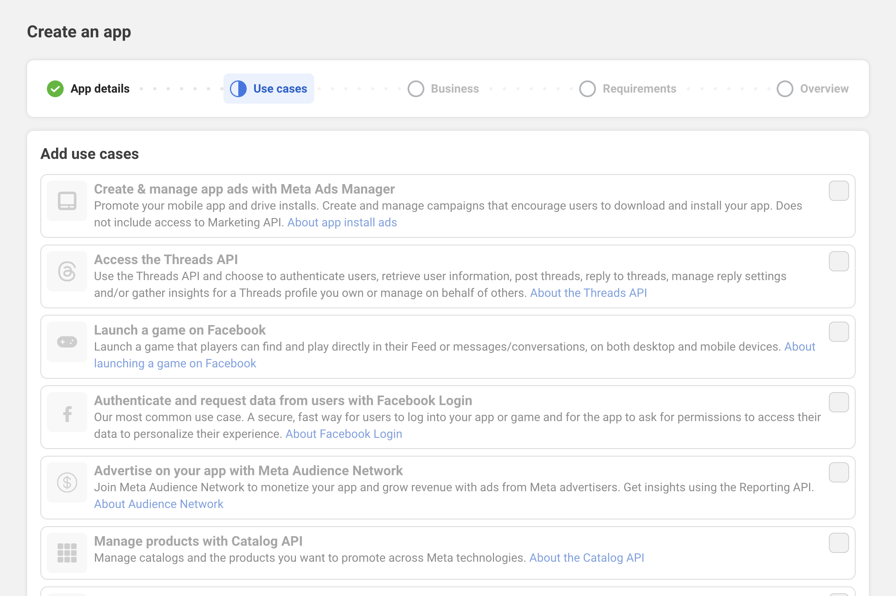
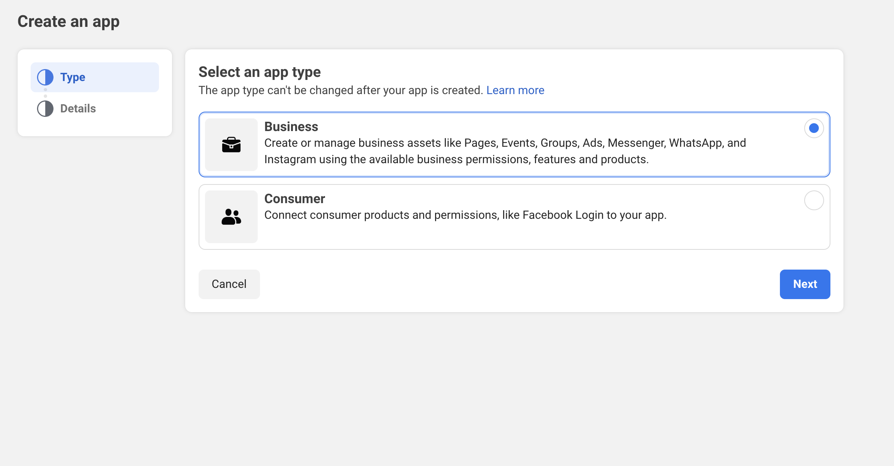
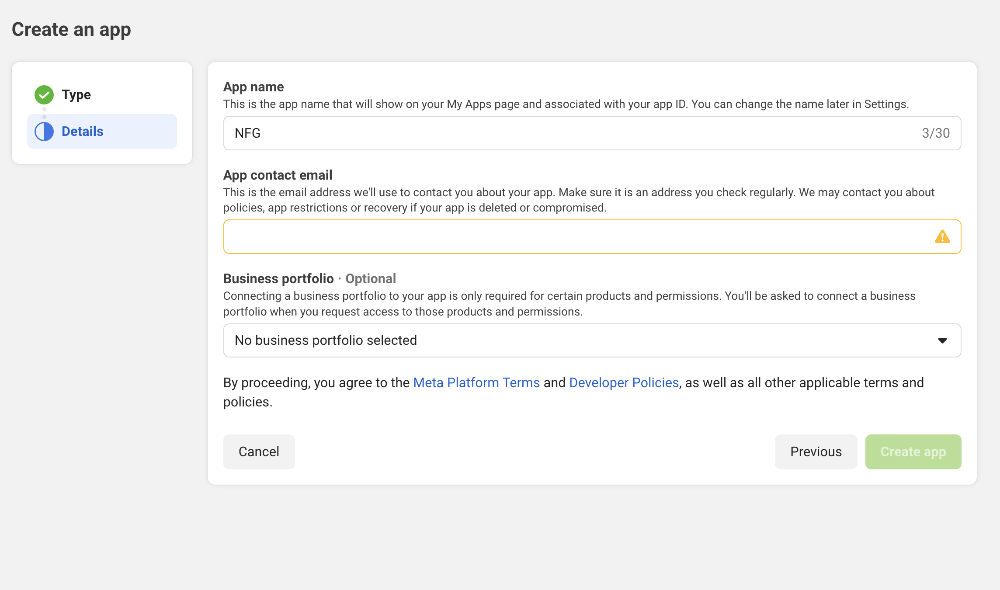
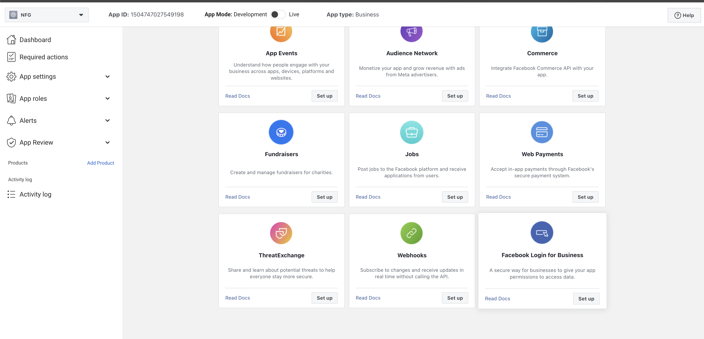
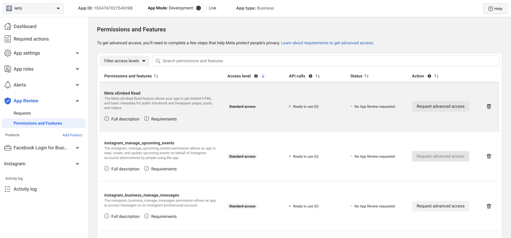

# Facebook开发者App指南

1. 访问Meta开发者中心, 点击创建app
   
2. 选择"Other"并点击下一步
   
   
3. 选择应用类型 Business
   
4. 填写App Details并点击创建app
   
5. 进入app dashboard
   
6. 在产品列表中找到Facebook Login For Business, 并点击setup
   
7. 在product设置页面填写信息并设置redirect URIS
   
8. 在左侧菜单栏点击App Review 并选择Permissions and Features
   
    申请以下scopes
    1. pages_show_list,business_management, pages_manage_posts, pages_manage_engagement, pages_read_engagement, read_insights
9. 将 App Mode从development切换到Live
    1. 如果该app仅自己使用，则无需进行审核
    2. 如果该app也需要提供给其他人使用，需要在App Review - Requests中按照Meta的审核要求，完成app requests  review
10. 在App settings中复制App ID以及 App Secret到项目的配置文件中，现在Facebook平台的发布功能就已经可以使用了
    