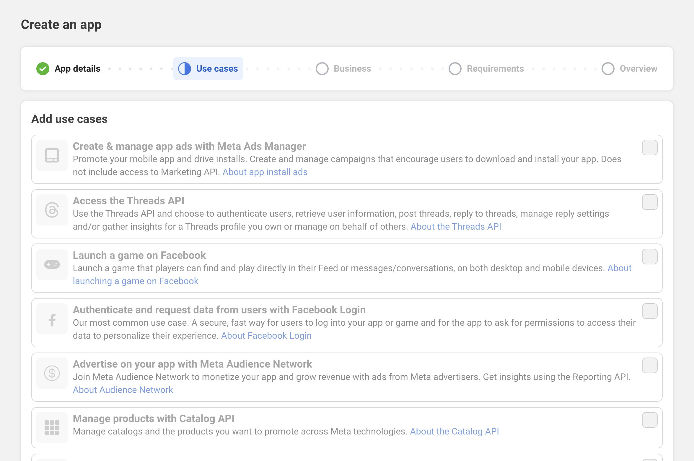
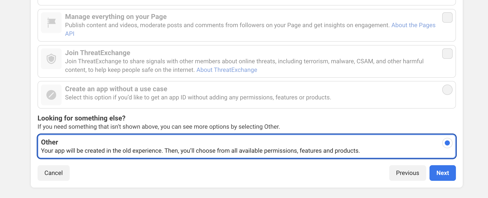
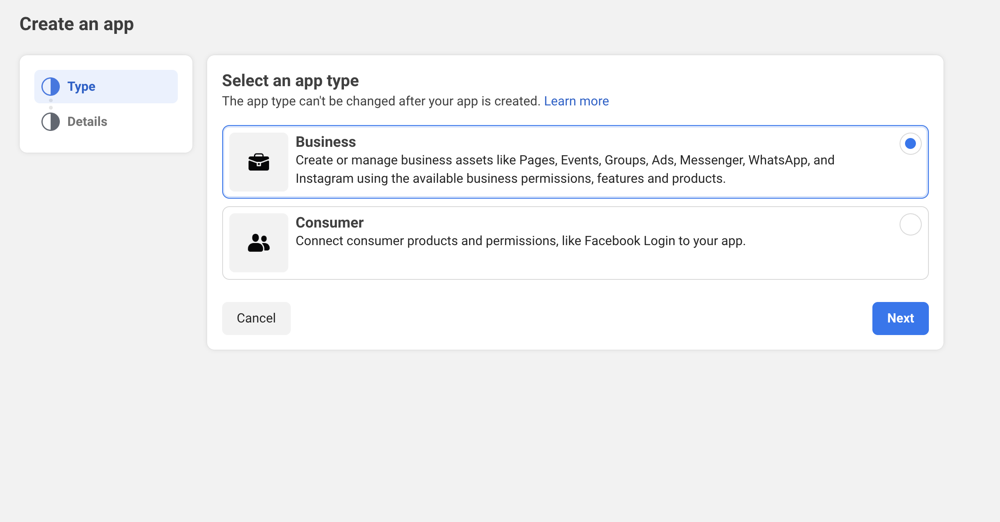
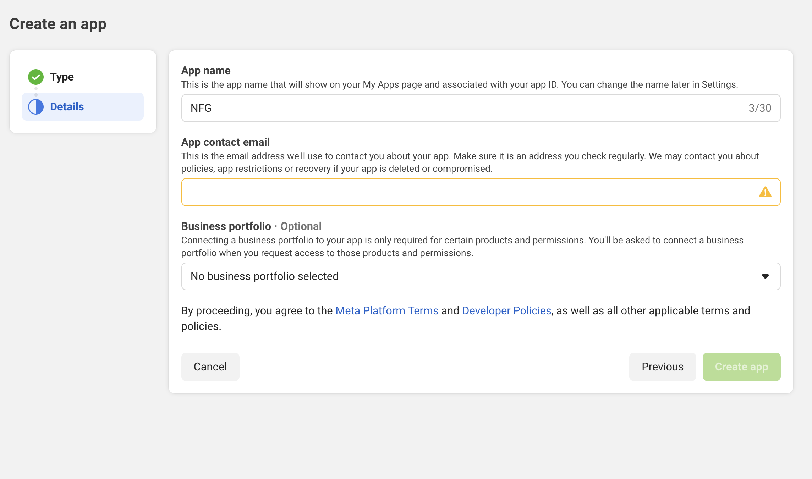
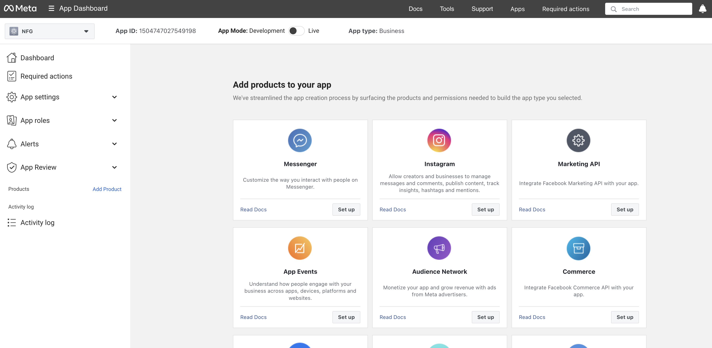
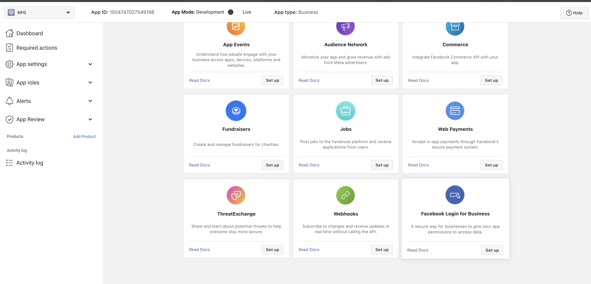
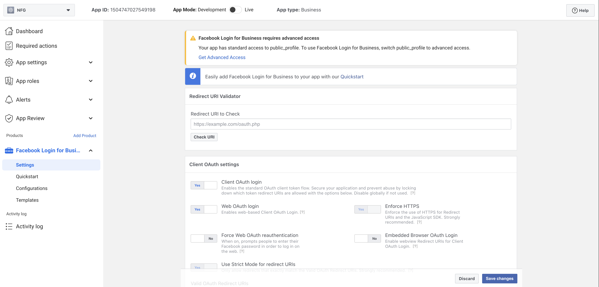
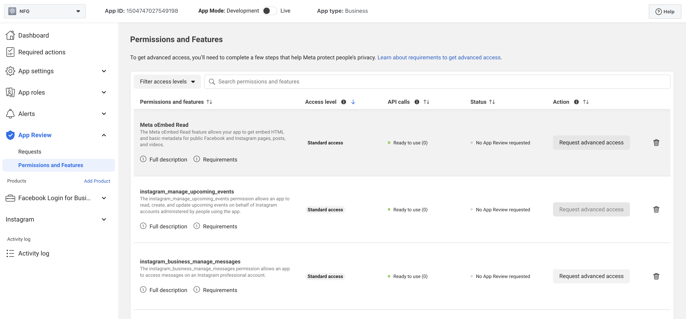
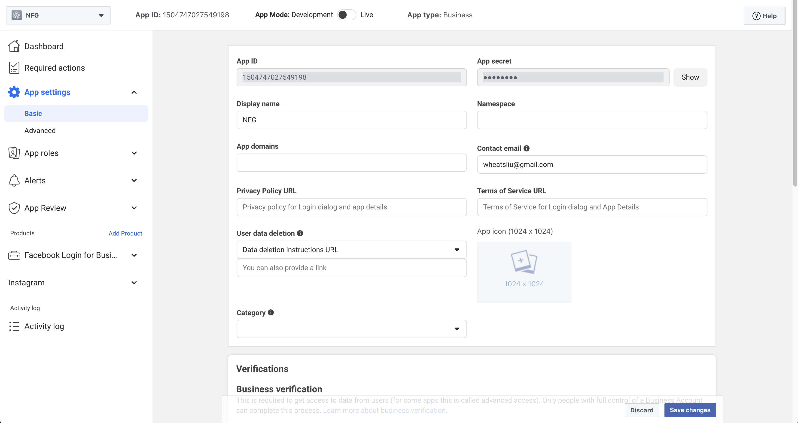

# Facebook Developer App Guide

1. Visit Meta Developer Center and click Create App
   
2. Select "Other" and click Next
   
   
3. Select app type Business
   
4. Fill in App Details and click Create App
   
5. Enter app dashboard
   
6. Find Facebook Login For Business in the product list and click Setup
   
7. Fill in information on the product settings page and set redirect URIs
   
8. Click App Review in the left menu and select Permissions and Features
   
    Apply for the following scopes:
    1. pages_show_list, business_management, pages_manage_posts, pages_manage_engagement, pages_read_engagement, read_insights
9. Switch App Mode from development to Live
    1. If this app is only for your own use, no review is required
    2. If this app also needs to be provided to other users, you need to complete app requests review in App Review - Requests according to Meta's review requirements
10. Copy the App ID and App Secret from App Settings to the project configuration file. Now the Facebook platform publishing function is ready to use
    
