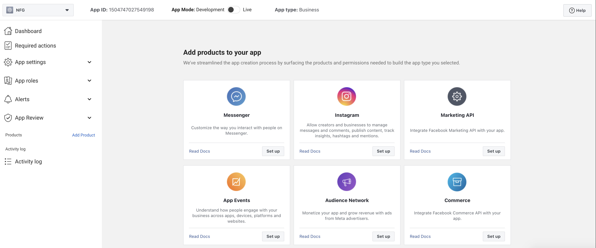
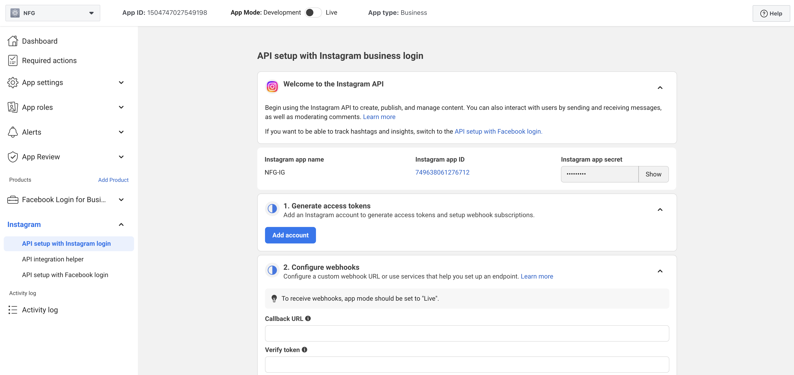
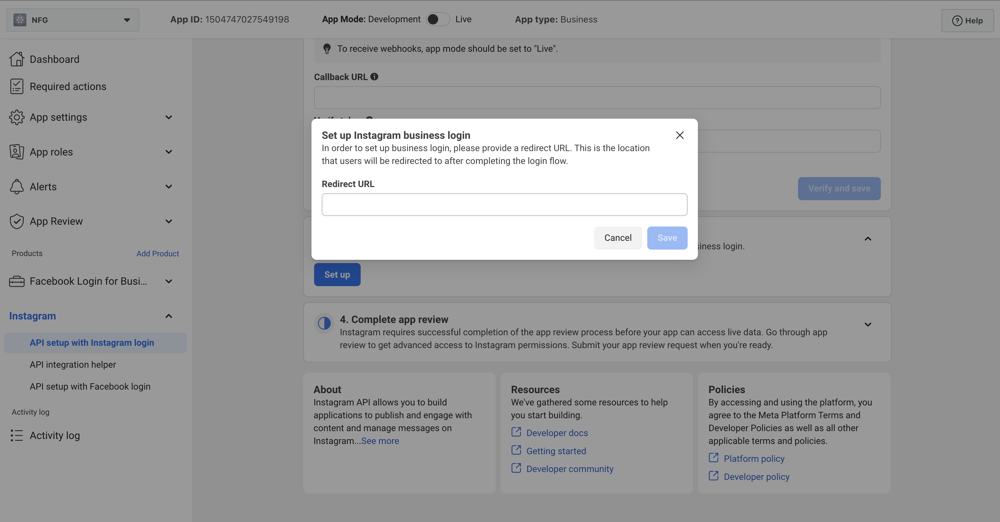

# Instagram开发者APP指南

1. 参考Facebook开发者APP指南，如果尚未创建APP则创建新的APP，如果已经创建完成APP，则添加product即可,在app dashboard页面选择Instagram并点击set up
   
2. 完成Instagram business login配置
   
3. 配置Redirect URL
   
4. 复制Instagram app ID以及Instagram app Secret到项目配置文件
   现在就可以使用instagram平台的发布功能了.