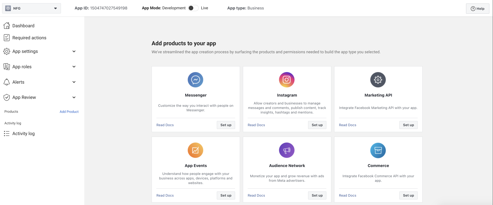

# Instagram Developer App Guide

1. Refer to the Facebook Developer App Guide. If you haven't created an app yet, create a new app. If you have already created an app, just add the product. On the app dashboard page, select Instagram and click Set Up
   
2. Complete Instagram Business Login configuration
   
3. Configure Redirect URL
   
4. Copy the Instagram App ID and Instagram App Secret to the project configuration file
   Now you can use the Instagram platform publishing function.
