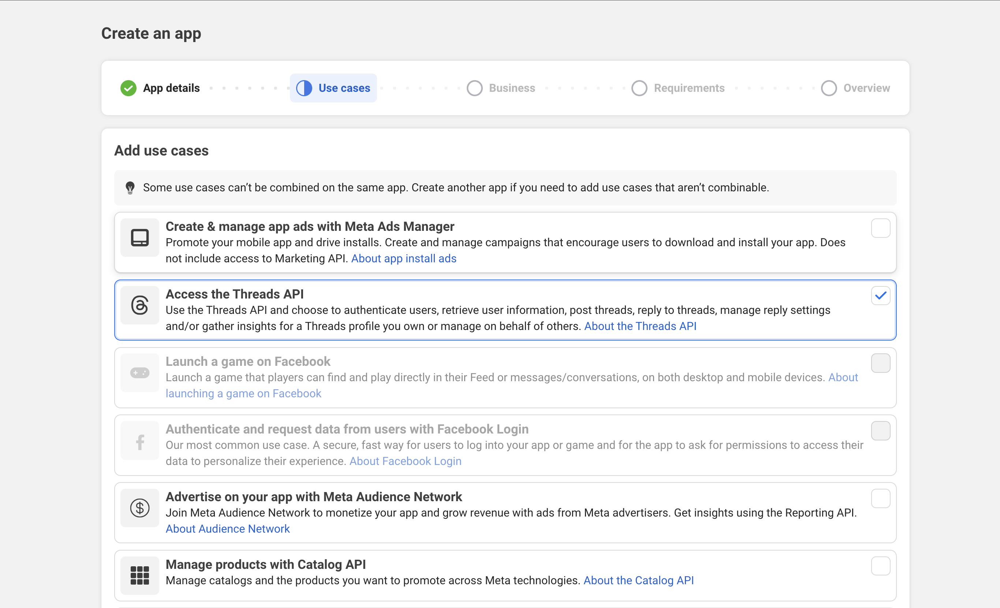
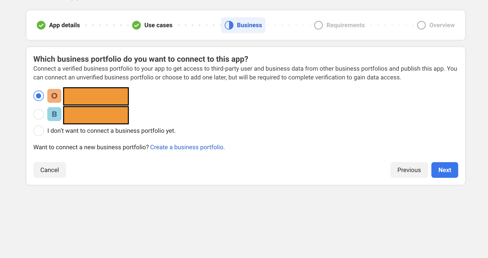
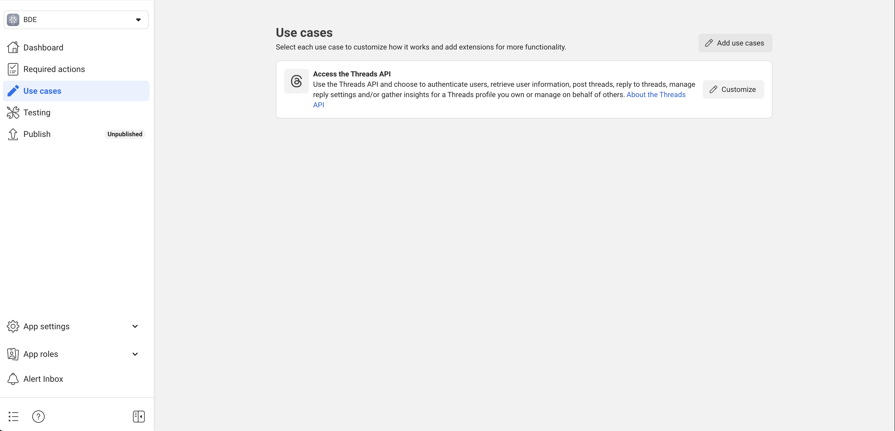
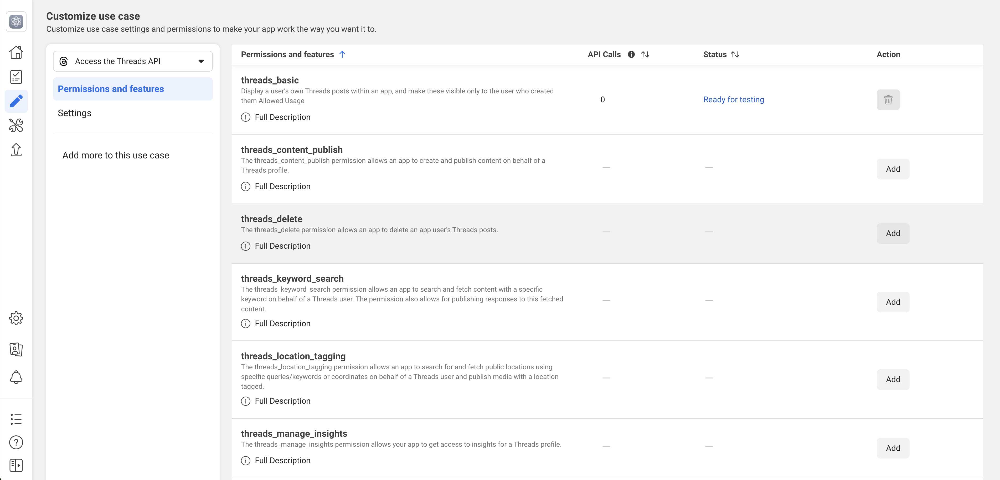
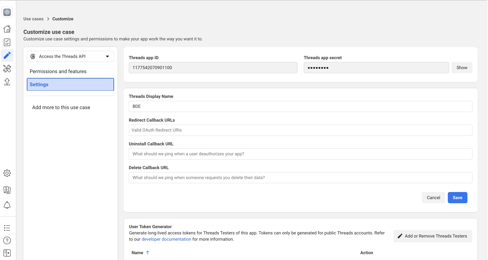

# Threads开发者App指南

1. 访问Meta开发者中心, 点击创建app
   
2. 选择use case，这里我们选择Access the Threads API
   
3. 根据实际情况，选择business portfolio
   
4. 完成app创建
   
   
5. 点击菜单栏的Use Cases，然后点击Threads use case中的Customize，并添加所需权限
   
   
6. 点击settings设置Redirect URL
   
7. 在App settings中复制App ID以及 App Secret到项目的配置文件中，现在Threads平台的发布功能就已经可以使用了
   