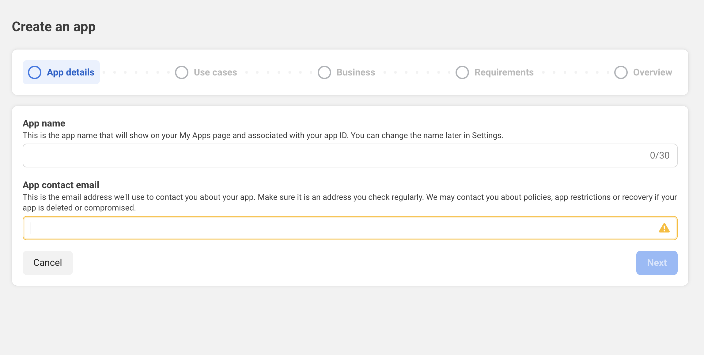
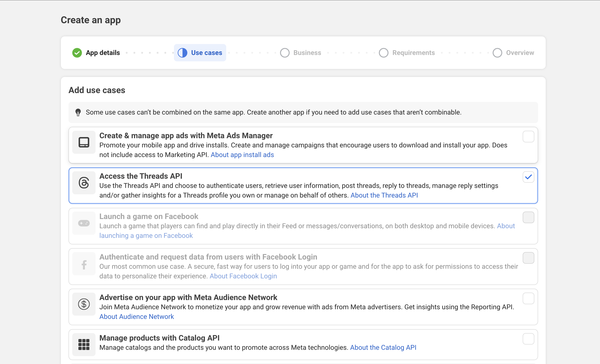
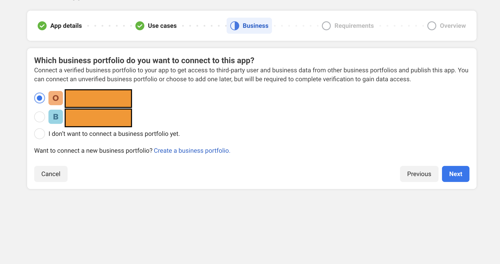
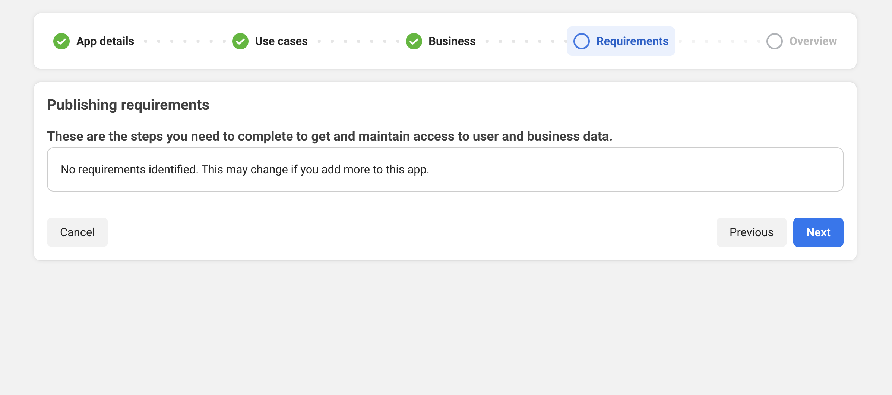
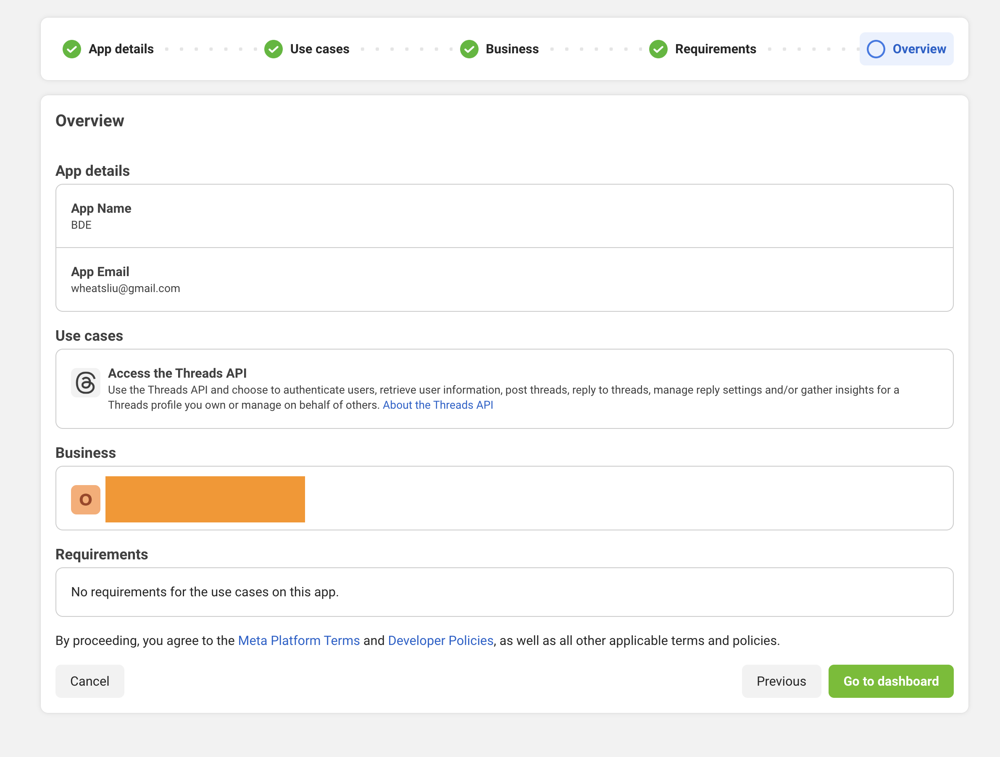
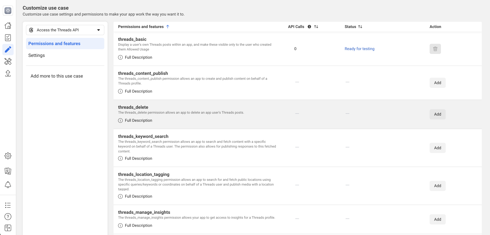
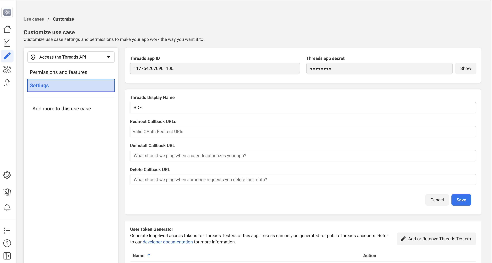

# Threads Developer App Guide

1. Visit Meta Developer Center and click Create App
   
2. Select use case, here we choose Access the Threads API
   
3. According to your actual situation, select business portfolio
   
4. Complete app creation
   
   
5. Click Use Cases in the menu bar, then click Customize in the Threads use case and add required permissions
   
   
6. Click Settings to set Redirect URL
   
7. Copy the App ID and App Secret from App Settings to the project configuration file. Now the Threads platform publishing function is ready to use
   
