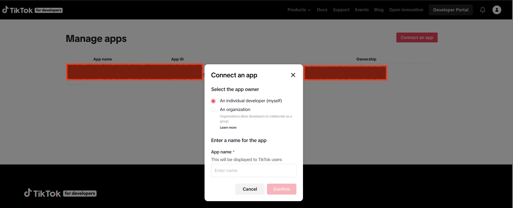
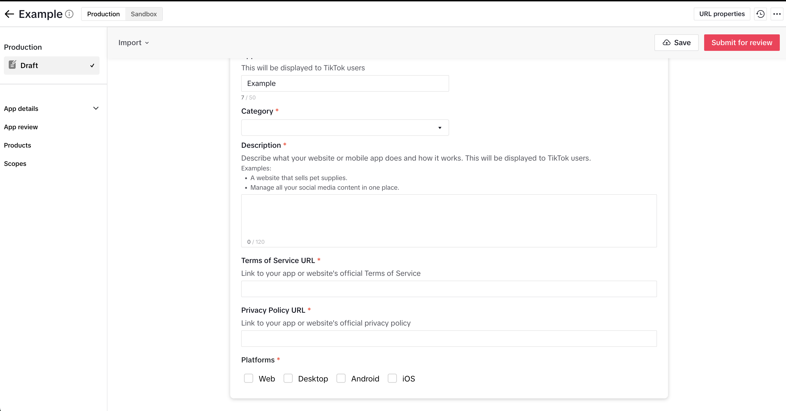
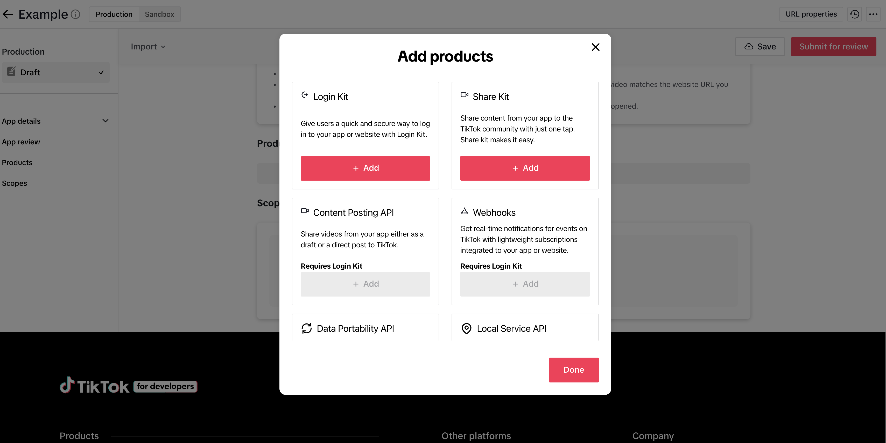

# Tiktok开发者App指南

1. 访问tiktok开发者网站并点击Connect an app
   
   
2. 完成app基础设置，terms of Service URL, Privacy policy URL
3. 添加product，选择login kit, Content Posting API, Webhooks
   
4. 添加scopes
   
5. 复制Client ID,以及Client Secret设置到项目配置中，现在Tiktok平台的发布功能就已经可以使用了
