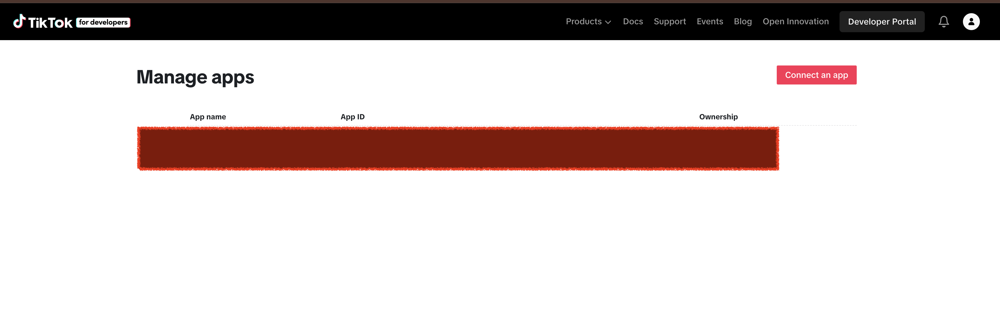
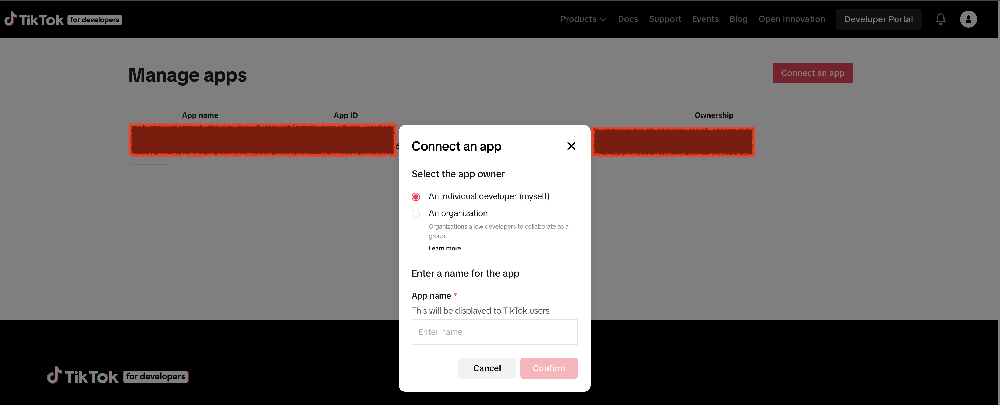
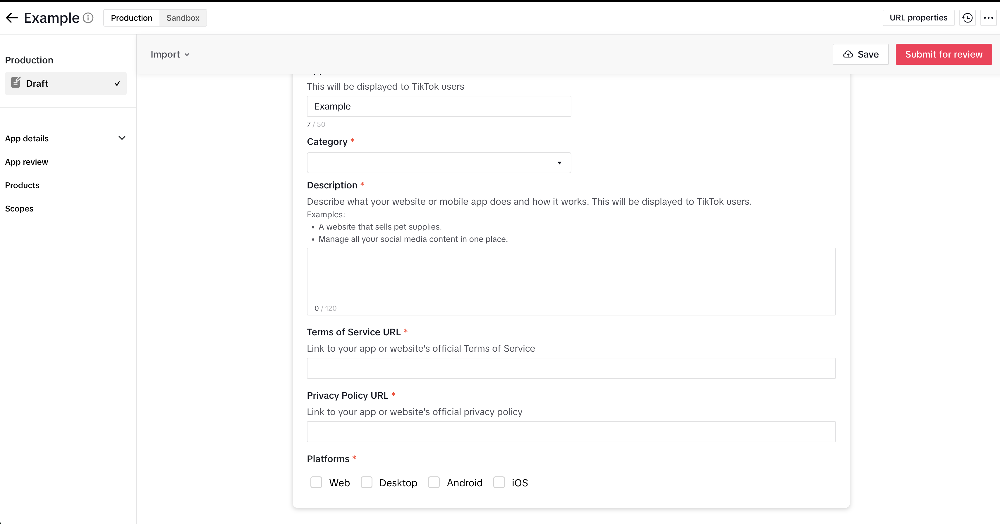
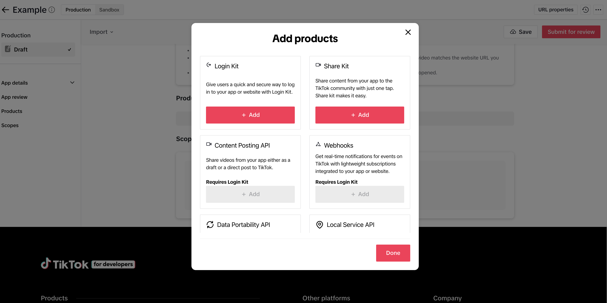
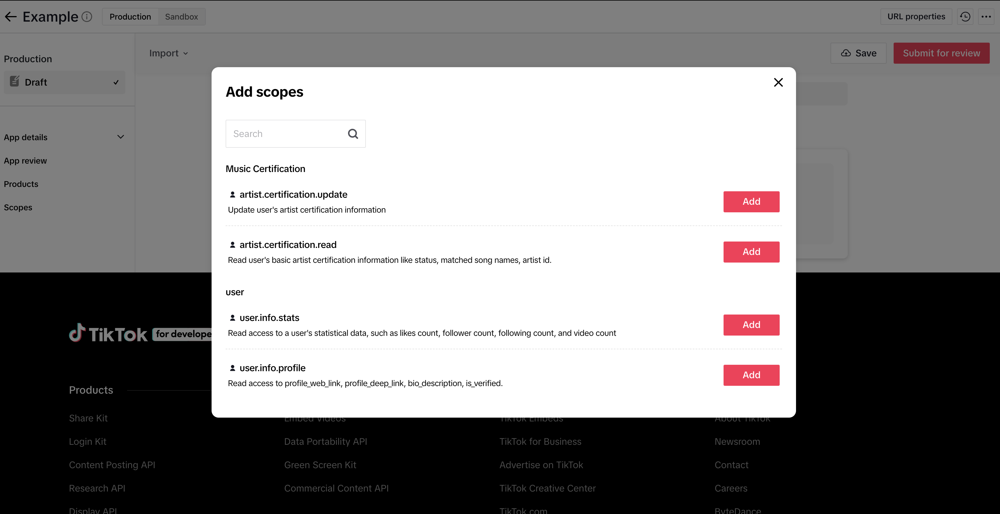

# TikTok Developer App Guide

1. Visit TikTok Developer website and click Connect an app
   
   
2. Complete app basic settings, Terms of Service URL, Privacy Policy URL
   
3. Add product, select Login Kit, Content Posting API, Webhooks
   
4. Add scopes
   
5. Copy Client ID and Client Secret to project configuration. Now the TikTok platform publishing function is ready to use
