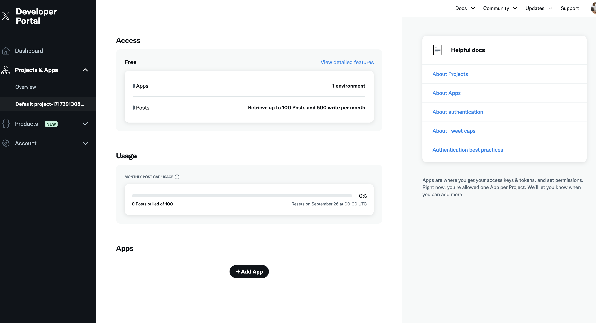
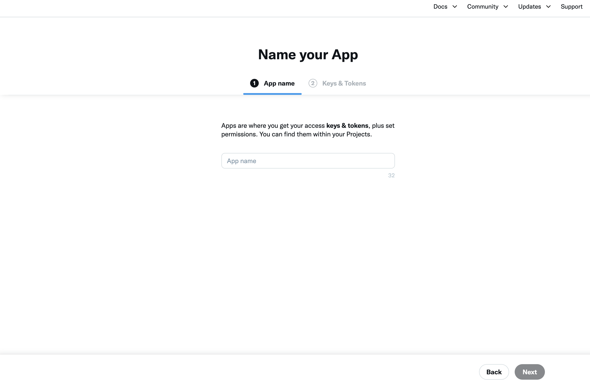
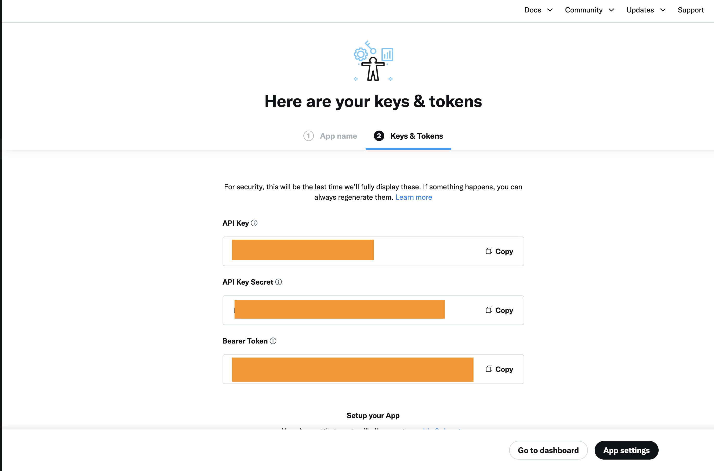
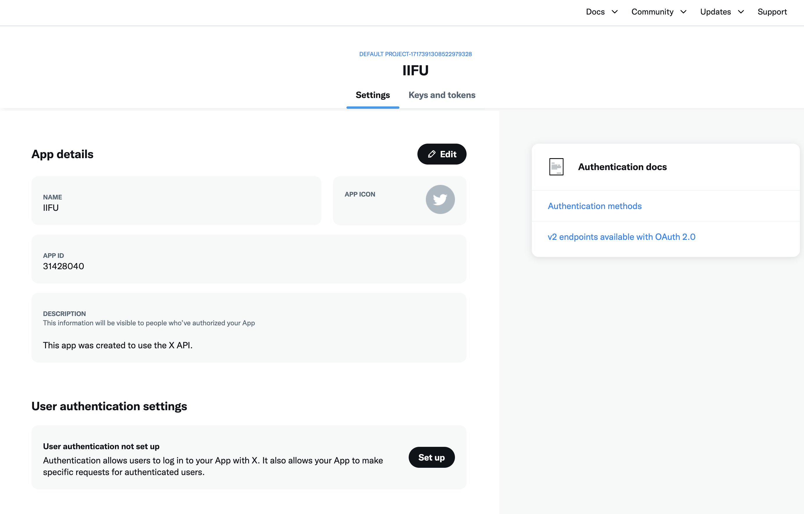
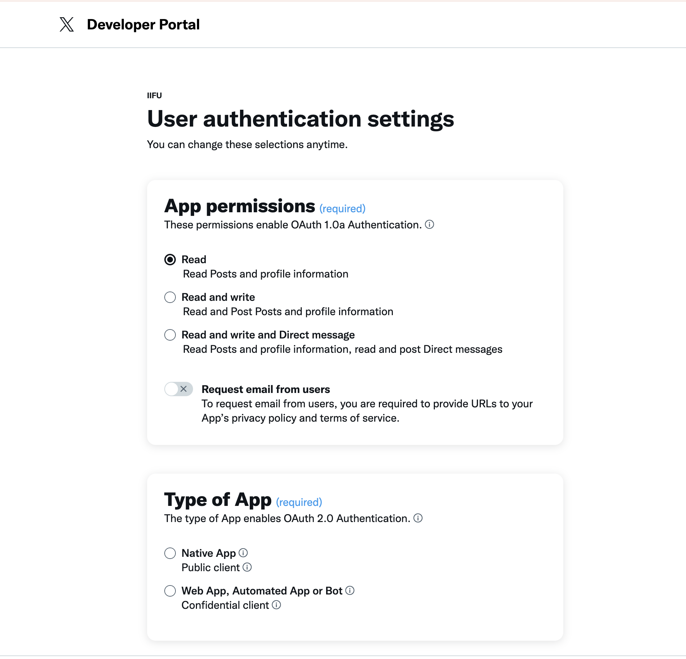
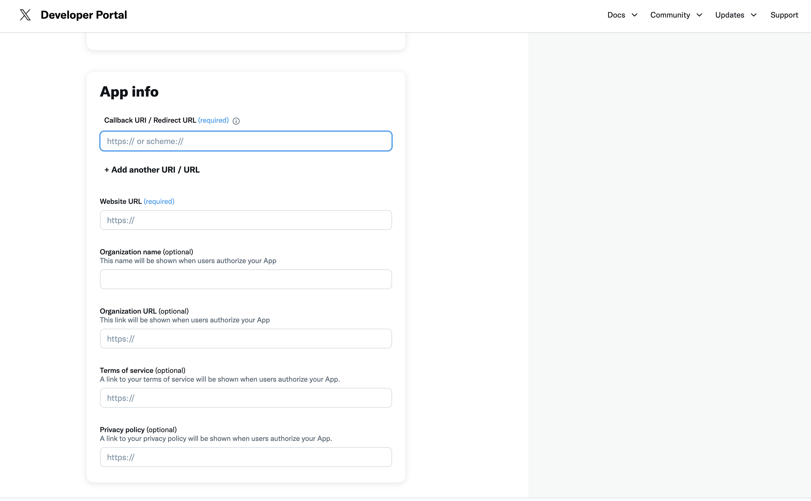

# X开发者App指南

1. 访问X开发者中心，Projects & Apps 选择默认Project，点击Add app
   
2. 输入app name
   
3. 设置并保存keys & tokens, 完成app创建
   
4. 设置user authentication settings, 包括Redirect URL
   
   
   
5. 将步骤3中保存的API key and Secret设置到项目配置中，现在X平台的发布功能就已经可以使用了
