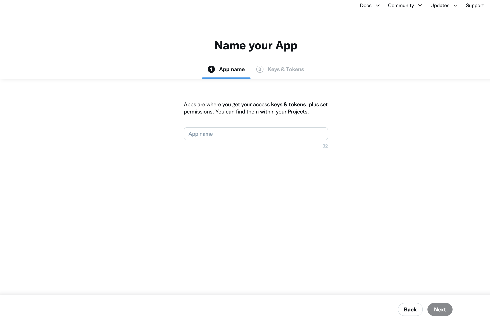
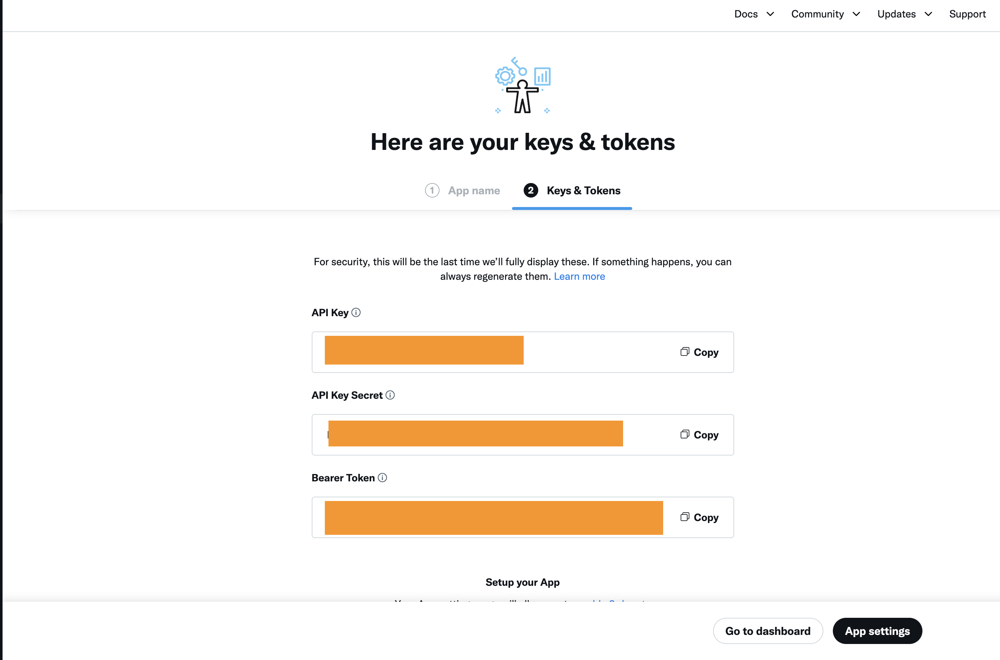
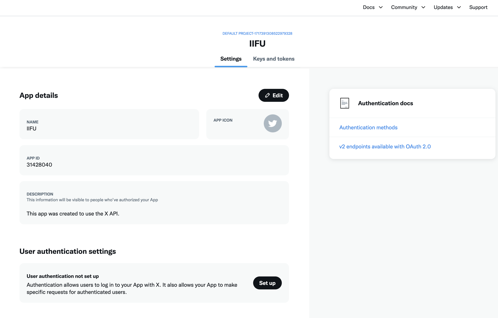

# X Developer App Guide

1. Visit X Developer Center, Projects & Apps select default Project, click Add app
   
2. Enter app name
   
3. Set and save keys & tokens, complete app creation
   
4. Set user authentication settings, including Redirect URL
   
   
   
5. Set the API key and Secret saved in step 3 to the project configuration. Now the X platform publishing function is ready to use
