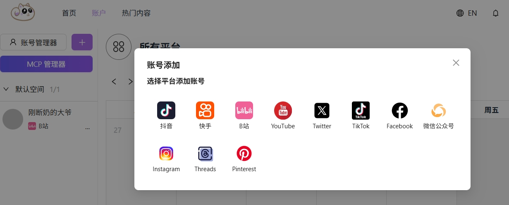
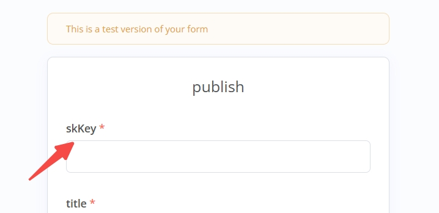

<!--
 * @Author: nevin
 * @Date: 2025-01-17 19:25:28
 * @LastEditTime: 2025-02-24 19:37:13
 * @LastEditors: nevin
 * @Description: 
-->
# AiToEarn Web

[English](README_EN.md) | 简体中文

## Project Introduction

AiToEarn's WEB project is a web application that implements multi-platform content publishing. It supports the following 12 major social media platforms:

<div style="display: flex; gap: 15px; align-items: center; flex-wrap: wrap; margin: 20px 0;">
    
    
    
    
    
    
    
    
    
    
    
</div>

**Supported Platforms for Matrix Publishing:** Douyin, Xiaohongshu, Kuaishou, Bilibili, WeChat Official Accounts, TikTok, YouTube, Facebook, Instagram, Threads, Twitter, Pinterest

Project URL: [Aitoearn](https://aitoearn.ai)

## Directory Structure

### Web Frontend

**Technology Stack:**
- React
- TypeScript
- next

**Startup Command:**
```bash
pnpm run dev
```

### Backend

**Technology Stack:**
- NestJS Node.js framework
- NATS message queue
- MongoDB
- Redis
- AWS S3
- BullMQ

#### 1. `aitoearn-gateway` - Gateway Module
```
├── config                                   Configuration files for different environments
│
├── src                                      
│   ├── auth                                 Authentication module
│   ├── common                               Common module
│   ├── core                                 Main process source code
│   │   ├── file                             File module
│   │   ├── plat                             Third-party platform module
│   │   └── ...                              Others
│   ├── libs                                 Utility modules
│   ├── transports                           Communication module
│   └── views                                Views
```

#### 2. `aitoearn-channel` - Channel Module
```
├── config                                   Configuration files for different environments (developer keys and secrets for various third-party platforms, WeChat third-party platform configured in aitoearn-wxplay project configuration file)
│
├── src                                      
│   ├── common                               Common module
│   ├── core                                 Main process source code
│   │   ├── account                          Third-party platform account module
│   │   ├── dataCube                         Third-party platform data statistics module
│   │   ├── file                             File module
│   │   ├── interact                         Interaction module
│   │   ├── mcp                              MCP service module
│   │   ├── plat                             Third-party platform module
│   │   ├── publish                          Publishing module
│   │   ├── skKey                            skKey module
│   │   └── ...                              Others
│   ├── libs                                 Utility modules
│   ├── transports                           Communication module
│   └── views    
```

#### 3. `aitoearn-user` - User Module

#### 4. `aitoearn-wxplat` - WeChat Third-Party Platform Service (Decoupled Development Environment)

**Quick Start:**
```bash
npm run dev:local
```
## MCP Service

### 1. Configure Platform Accounts

Add platform accounts on the frontend page:


### 2. Create `skkey` Associated with Multiple Accounts


### 3. Create and Configure Workflows

- Create workflows on the workflow platform (or import templates from the workflow folder)
- Use `skkey` in workflow parameter settings for content publishing


### Interface Used by Workflow Platform
`aitoearn-channel\src\core\mcp\plugin.controller.ts`

## Advanced Settings
### Platform Application and Setup ###
1. [Bilibili](CHANNEL_Md/BILIBILI_EN.md)
1. [WeChat Third-Party Platform](CHANNEL_Md/WXPLAT_EN.md)


## Roadmap
- Add more platforms
- Add more features

## Usage

### 1. Start Backend Service Modules

Local startup: Create a `local.config.js` file in the config directory (copy the `dev.config.js` file and modify the configuration)

```bash
pnpm install
pnpm run dev:local
```

### 2. Start Frontend Project `aitoearn-web`

```bash
pnpm install
pnpm run dev
```
## Contribution Guide

Please see [Contribution Guide](CONTRIBUTING_EN.md) for information on how to contribute to the project development.

## Contact Us

If you have any questions, please contact us through the following ways:

- Submit GitHub Issues
- Send email to [contact@aitoearn.ai](mailto:contact@aitoearn.ai)