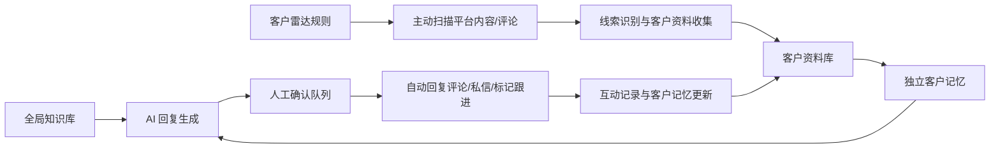

# 巨鲸网络客户增长自动化逻辑

## 当前判断

知识库应该是全局能力，不应该只放在客户雷达里。客户雷达、自动回复评论、私信跟进、内容发布、AI 客服都应该引用同一个全局知识库，再叠加客户自己的独立记忆。

当前项目已经存在一些评论能力，客户雷达也已经从前端原型推进到本地可运行 MVP：

- Web 插件侧已有小红书评论列表、子评论列表、评论作品能力。
- Web 插件侧已有小红书关键词搜索抓取能力，主动获客主链路按关键词搜索别人笔记/评论，不依赖笔记 ID。
- Web 插件侧已有抖音评论作品和私信能力，但抖音评论列表仍是 TODO。
- 后端已有 `channel/engagement` 评论回复任务、AI 批量生成回复、队列分发、回复记录 schema。
- 新增的 `customer-growth` 后端模块已经提供客户雷达工作区、全局知识库、系统 AI 配置、客户套餐、租户 AI 配置和回复生成接口。
- 客户雷达页面已经能保存真实工作区数据、运行获客任务、沉淀客户资料、生成候选回复、记录批次、导出复盘、处理二次触达队列。
- 真实平台写操作仍保持受控：默认只读抓取和候选回复，真实发布评论只允许在明确测试账号和测试笔记上验收。

## 产品总逻辑

## 模块划分

### 1. 全局知识库

全局知识库是 AI 的业务大脑，保存公司统一事实和约束：

- 公司介绍、产品能力、套餐边界。
- 成功案例、行业案例、常见问题。
- 平台风控边界，例如不做无节制群发、不承诺违规抓取。
- 回复语气规则，例如先帮助再引导，不硬卖。

调用方式：

- AI 回复前先检索全局知识库。
- 再叠加客户画像、客户记忆、当前评论内容。
- 最后生成候选回复和下一步动作。

### 2. 客户雷达

客户雷达负责发现潜在客户：

- 配置行业、地区、关键词、痛点词、排除词和平台范围。
- 扫描社媒内容、评论区、作者主页、互动信号。
- 评论来源必须区分两类：
  - 关键词搜索别人笔记/评论：用于主动找新客户，重点是需求识别、低打扰触达和风控。
  - 自己发布笔记评论：用于处理已经进来的咨询，重点是回复效率、客户记忆和转化跟进。
- 提取需求摘要、意向等级、客户阶段和建议动作。
- 把有效线索沉淀到客户资料库。

### 3. 客户资料库

客户资料库不是简单线索池，而是持续跟进的 CRM：

- 基础资料：昵称、平台、主页、城市、行业、店铺/公司。
- 来源资料：来自哪个作品、哪条评论、哪个关键词。
- 阶段资料：新线索、培育中、已确认需求、已触达、已转化。
- 互动资料：评论、私信、人工备注、电话、已发送回复。

### 4. 独立客户记忆

客户记忆按客户维度保存，不进入全局知识库：

- 这个客户之前说过什么。
- 他关心价格、效果、风控还是案例。
- 他适合什么方式跟进。
- 之前 AI 或人工回复过什么，避免重复和前后矛盾。

### 5. 自动回复评论

自动回复评论应该是受控执行，不应该默认全自动乱发：

1. 拉取作品评论。
2. AI 判断是否值得回复。
3. 生成候选回复。
4. 风控过滤：敏感词、频率、平台限制、重复回复。
5. 进入人工确认队列。
6. 用户批准后，执行插件或后端 provider 的评论回复。
7. 写入回复记录，并更新客户记忆。

默认策略建议：

- MVP 阶段：人工确认后自动发布。
- 可配置全自动发布：生成候选回复后直接发布，并写入日志、互动记录和客户记忆。
- 稳定后：建议按来源和风险分层。自己笔记评论可更自动化；搜索别人笔记/评论的主动触达要更低频、更谨慎。
- 所有自动动作必须有任务详情、暂停、结束、回滚状态记录。

## 当前可复用能力

### 前端插件侧

- 小红书：`getCommentList`、`getSubCommentList`、`commentWork` 已存在。
- 抖音：`commentWork`、`sendDirectMessage` 已存在。
- 抖音评论列表：当前标记为 TODO，需要补齐才能做评论挖掘。

### 后端侧

- `POST /channel/engagement/comment/ai/replies` 可生成评论回复。
- `POST /channel/engagement/comment/ai/replies/tasks` 可创建 AI 回复评论任务。
- 队列 `engagement_reply_to_comment_task` 可执行评论回复。
- 当前后端 provider 主要覆盖 Facebook / Instagram / Threads / YouTube，不覆盖小红书/抖音插件任务。

## 当前本地 MVP 已落地

本地部署版已经有一条可运行、可复测的半自动流程：

- 全局知识库页面：维护方案、案例、FAQ、边界和语气规则；接口已接后端，当前本地已初始化 5 条基础业务知识。
- 客户雷达页面：配置客户画像、扫描平台、查看线索池。
- 自动获客任务中枢：支持手动、每小时、每天一次任务；任务会记录运行批次和最近日志。
- 评论来源配置：支持“搜索别人笔记/评论”和“自己发布笔记评论”两种来源。
- 回复模式配置：支持“人工确认后发布”和“不需要人工确认的全自动发布”。
- 平台执行器能力：检测浏览器插件、小红书/抖音等平台是否支持抓评论、发评论、发私信；小红书关键词搜索已通过真实只读验证。
- 任务详情与日志：记录插件检测、扫描完成、暂停、模拟发布、异常等任务过程。
- 任务批次复盘：展示本批次线索、候选回复、运行统计，支持 CSV 导出。
- 自己笔记评论接入：支持输入小红书笔记 ID，插件在线时调用小红书评论列表；插件未就绪时使用样例评论验证流程。笔记 ID 只用于这条辅助链路。
- 评论回复确认队列：展示客户评论、候选回复、客户记忆、引用知识和风险说明。
- 人工确认动作：支持批准、忽略、发布回复。
- 发布后回写：模拟发布成功后，把互动记录写入客户资料库，并追加独立客户记忆。
- 客户资料库：支持客户阶段、价值等级、客户记忆、互动记录、跟进状态回写。
- 二次触达队列：支持状态筛选、下次跟进时间、跟进备注、到期提醒、已跟进/保留二触/无效处理。
- 重复触达降噪：已跟进/无效客户会跳过，培育中/已确认需求客户会归入二次触达记忆，不再堆重复线索。

当前仍未达到正式上线：全局知识库需要初始化业务内容，真实发布评论需要测试账号和测试笔记完成受控验收，运行中的 Docker 镜像也需要用最新后端源码重建而不是依赖本地开发态。

## 后续实现顺序

1. 初始化全局知识库：把公司能力、案例、FAQ、边界和回复语气沉淀成后端数据。
2. 真实发布前安全验收：准备测试账号、测试笔记和单条评论回复清单，只在明确测试环境执行。
3. Docker 镜像重建：让运行中的后端容器包含最新 `customer-growth` 源码和 Mongo schema/repository。
4. 自己发布笔记评论自动回复：继续强化小红书笔记评论抓取、生成、确认/全自动发布、记忆回写。
5. 平台扫描适配：补抖音评论列表，区分只读扫描和写操作权限。
6. 回复生成质量：用全局知识库 + 客户记忆 + 当前评论生成候选回复，并记录模型来源和 fallback 原因。
7. 风控策略：频率上限、重复回复检测、敏感词过滤、失败重试、真实平台写操作审计。
8. 提交与部署：把客户雷达、插件、后端、文档变更分批提交，清理运行产物和测试截图。

## MVP 验收标准

- 能创建一条客户雷达扫描任务。
- 能从小红书评论里收集线索。
- 能把评论作者生成客户资料。
- 能为客户生成独立记忆。
- 能引用全局知识库生成候选回复。
- 能在人工确认后发布评论回复。
- 能查看任务详情、客户资料、历史回复和执行结果。
